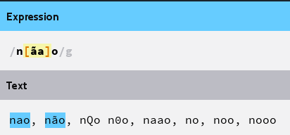

A expressão regular `n.a` casa com "não" e "nao", e também com coisas indesejáveis como "n-o", "n5o", "n o" e etc...

Ao substituir a expressão `n.a` por `n[ãa]o`, reduzimos a possibilidade de resultados para somente "não" e "nao".

