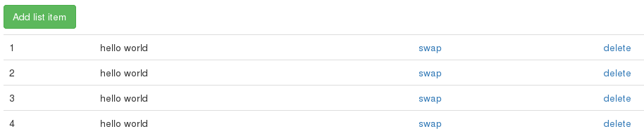

Este é o terceiro exemplo demonstrando o Backbone, ele é uma extensão do anterior. Por tanto, se você não
conseguir entender este código, aconselho a tentar entender os dois exemplos anteriores.

Neste exemplo vamos acrescentar dois links para a view que representa a linha (`tr`) da tabela: "swap" e "delete".
Ligaremos os eventos aos links utilizando a função `events()` do Backbone. Tais eventos irão, por sua vez, serão anexados
aos eventos do modelo.

Como ainda não queremos finalizar a comunicação com o servidor, sobrescrevemos a função `sync` de tal forma que ela
cumpre essa tarefa (anular a requisição Ajax).

Nosso HTML continua o mesmo...

```html
<div class="container">
    <table class="table">
        <caption><button id="add" class="btn btn-success">Add list item</button></caption>
    </table>
</div>
```

Porém, vamos utilizar um template no HTML....

```
<script type="text/template" id="linha">
    <td><%= id %></td>
    <td><%= part1 %> <%= part2 %></td>            
    <td><a href="" class="swap">swap</a></td>            
    <td><a href="" class="delete">delete</a></td>            
</script> 
```

Veja uma prévia da interface.




Eis o JavaScript...

```javascript
// Sobrescrevemos o método que conversa com o servidor
Backbone.sync = function(method, model, success, error){
   console.log(method + " model.id=" + model.id);
}

// model
var Item = Backbone.Model.extend({
    url: "foo/",
    defaults: {
        part1: 'hello',
        part2: 'world'
    }
});

// collection
var List = Backbone.Collection.extend({
    model: Item
});

// View representando cada linha (`tr`) de nossa tabela
var ItemView = Backbone.View.extend({
    tagName: 'tr',

    // Como "ligamos" o template
    template: _.template( $("#linha").html(), {} ),

    // Vamos definir os callbacks para os links
    events: {
      'click a.swap':   'swap',
      'click a.delete': 'remove'
    },

    // Aproveitamos para anexar os callbacks
    // aos eventos do modelo.
    initialize: function(){
      this.model.on('change', this.render, this);
      this.model.on('remove', this.unrender, this);
    },  

    render: function() {
        this.$el.html(this.template(this.model.attributes));
        return this;
    },

    unrender: function() {
        // remover trecho HTML
        this.$el.remove();
    },

    // Trocamos o valor do modelo
    swap: function(evt) {
      evt.preventDefault();
      this.model.set({part1: "other"});      
    },

    // Apagamos o modelo
    remove: function(evt) {
      evt.preventDefault();
      this.model.destroy();
    }
});

// Esta é a visão principal
var ListView = Backbone.View.extend({
    el: $('table'),

    events: {
        'click button#add': 'addItem'
    },

    initialize: function () {
        this.collection = new List();
        this.collection.on('add', this.appendItem, this);
    },

    addItem: function () {
        var item = new Item({
            id: (this.collection.length + 1)
        });
        this.collection.add(item);
    },

    appendItem: function (item) {
        var itemView = new ItemView({model: item});
        this.$el.append(itemView.render().el);
    }
});

var listView = new ListView();
```