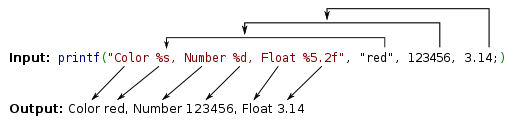

Rápida introdução a __linguagem C__.

Ela é curta porque o objetivo é suprir o mínimo para você poder praticar os __exercícios de lógica de programação__.

Se você chegou até esta página por vias externas, veja o índice  de [lógica da programação](/../logica-de-programacao/)
para entender melhor a proposta.

Vamos experimentar a __linguagem C__ através do [Linux](/../linux/).


Primeiro programa
---

O programa inicia-rá no bloco da função `main`.

    int main() {
        ..seu código
        ..seu código
        ..seu código
    }

Como `main` é uma função, ela deve sempre retornar algo. Por isso acrescentaremos `return 0;`.

    int main() {
        ..seu código;
        ..seu código;
        ..seu código;
        return 0;
    }

E esse "algo" é do tipo inteiro `int main() {...`.

Poderíamos escrever um programa para imprimir "Primeiro programa"

    int main (){
        printf ("Primeiro programa\n");
        return 0;
    }

Mas `printf()` é uma função, de onde vem essa função?

Vem do cabeçalho `stdio` , que é a abreviação de "standar I/O" (input/output).

    #include <stdio.h>

    int main (){
        printf ("Primeiro programa\n");
        return 0;
    }

Digite o código acima em um editor de texto qualquer e depois compile/rode.

Você deve saber como [compilar](/c/como-compilar-no-linux/) o código no terminal.


Variáveis
---

A __linguagem C__ é "Case Sensitive", isto é, maiúsculas e minúsculas fazem diferença.

Se declararmos uma variável com o nome `soma` ela será diferente de `Soma`, `SOMA`, `SoMa` ou `sOmA`.

Os seguintes nomes são válidos: `minhaVariavel`, `minha_variavel` e `var1`.

Os seguintes nomes são inválidos: `minha-variavel` e `2var`.

Variáveis são espaços alocados na memória do computador.


Tipos
---

A __linguagem C__ possui diversos tipos, mas para começar basta:

<table>
    <tr>
        <th>Tipo</th>
        <th>Tamanho (bit)</th>
        <th>Extensão (range)</th>
    </tr>
    <tr>
        <td>char</td>
        <td>8</td>
        <td>0 a 255</td>
    </tr>
    <tr>
        <td>int</td>
        <td>16</td>
        <td>-32.768 a 32.767</td>
    </tr>
    <tr>
        <td>float</td>
        <td>32</td>
        <td>3.4e-38 a 3.4e+38</td>
    </tr>
    <tr>
        <td>double</td>
        <td>64</td>
        <td>1.7e-308 a 1.7e+308</td>
    </tr>
    <tr>
        <td>void</td>
        <td>0</td>
        <td>&nbsp;</td>
    </tr>
</table>

O tipo `char` comporta apenas caracteres.

O tipo `int` comporta os números inteiros.

Os tipos `float` e `double` comportam números reais, só que o `double` é de maior precisão. Também chamamos de 
"ponto flutuante" e "ponto flutuante de dupla precisão", respectivamente.

Cada tipo de dados possui uma extensão (range) diferente e ocupa um determinado espaço na memória. Inicialmente, isso não
é algo com que devemos nôs preocupar.


Declarando Variáveis
---

Variáveis devem ser declaradas antes do uso. Normalmente, fazemos isso no começo do código.

    int main () {
        float valorFracionado , saldo , salarioMinimo;
        char letra , ultimaLetra;
        int entrada1 , entrada2, entrada3;
    }

Também podemos declarar e inicializar variáveis.

    int main () {
        float saldo = 0.0
        char letra = "a";
        int entrada1 = 9;
    }


Operadores...
---

### Artiméticos

Com os operadores artiméticos podemos realizar cálculos matemáticos.

<table>
    <tr>
        <th>Símbolo</th>
        <th>Significado</th>
    </tr>
    <tr>
        <td> + </td>
        <td>adição</td>
    </tr>
    <tr>
        <td> - </td>
        <td>subtração</td>
    </tr>
    <tr>
        <td> * </td>
        <td>multiplicação</td>
    </tr>
    <tr>
        <td> / </td>
        <td>divisão</td>
    </tr>
    <tr>
        <td> % </td>
        <td>resto da divisão (módulo)</td>
    </tr>
</table>

A precedência de operadores é como se segue:

* `*` `/` `%` (esquerda para a direita)
* `+` `-` (esquerda para a direita)

Mas com a ajuda do parênteses `()` podemos alterar a precedência. 


### Relacionais


Com os operadores relacionais podemos montar __expressões__ para tomada de decisão.

O resultado de uma expressão é sempre verdadeiro (true) ou falso (false), normalmente colocamos as expressões entre parênteses.

Exemplo:

    (100 == 100) // true
    (150 == 10)  // false

<table>
    <tr>
        <th>Símbolo</th>
        <th>Significado</th>
    </tr>
    <tr>
        <td> > </td>
        <td>maior que</td>
    </tr>
    <tr>
        <td> >= </td>
        <td>maior OU igual a</td>
    </tr>
    <tr>
        <td> < </td>
        <td>menor que</td>
    </tr>
    <tr>
        <td> <= </td>
        <td>menor OU igual a</td>
    </tr>
    <tr>
        <td> == </td>
        <td>igual a</td>
    </tr>
    <tr>
        <td> != </td>
        <td>diferente de</td>
    </tr>
</table>


### Lógicos

Com os opradores lógicos podemos montar __expressões__ mais elaboradas, por exemplo:

    (valor1 > valor2) && (valor2 > valor3) // (valor1 maior que valor2) E (valor2 maior que valor3)

<table>
    <tr>
        <th>Símbolo</th>
        <th>Significado</th>
    </tr>
    <tr>
        <td> && </td>
        <td>E (and)</td>
    </tr>
    <tr>
        <td> || </td>
        <td>OU (or)</td>
    </tr>
    <tr>
        <td> ! </td>
        <td>negação (not)</td>
    </tr>
</table>


Produzindo saída de dados
---

### Saída

Para implementar a "saída" utilizamos a função `printf()`, ela depende do arquivo cabeçalho `stdio.h`.

    #include <stdio.h>

    int main (){
        printf ("Hello, world!\n");
        return 0;
    }

A função depende dos operadores de formatação listados abaixo.

<table>
    <tr>
        <th>Tipo</th>
        <th>Formato</th>
        <th>descrição</th>
    </tr>
    <tr>
        <td>char</td>
        <td>%c</td>
        <td>caraceter</td>
    </tr>
    <tr>
        <td>int</td>
        <td>%d</td>
        <td>inteiro</td>
    </tr>
    <tr>
        <td>float</td>
        <td>%f</td>
        <td>ponto flutuante (reais)</td>
    </tr>
    <tr>
        <td>char[]</td>
        <td>%s</td>
        <td>cadeia de caracteres (string)</td>
    </tr>
</table>

Ela (a função) aceita n parâmetros, sendo que o primeiro é sua string (cadeia de caracteres) e os demais dependerão da 
quantidade de varíaveis utilizadas "dentro" string. Veja a figura abaixo para entender melhor.




Exemplos:

    printf ("%s \n", "A string");                       // "A string"
    printf ("%s e um exemplo","Este")                   // "Este e um exemplo"
    printf ("Um caractere %c e um inteiro %d",'D',120)  // "Um caractere D e um inteiro 120"
    printf ("%f",40.345)                                // "40.345"


O operador `%%` é um __escape__ para o caracter `"%"`, veja exemplos:

    printf ("Teste %% %%")                              // "Teste % %"
    printf ("%s%d%%","Juros de ",10)                    // "Juros de 10%"


### Entrada

Já a entrada de dados fica por conta da função `scanf()`.

Ela depedende do mesmo arquivo cabeçalho `stdio.h` e tem o funcionamento muito parecido com a `printf()`.

Os operadores de formatação são os mesmos dos de saída.

Veja um exemplo básico:

```c
#include <stdio.h>

int main()
{
    int numero;
    printf("Digite um numero: ");
    scanf("%d", &numero);

    printf("O numero digitado foi: %d", numero);
}
```

Ao utilizar a função `scanf()`, repare que a acrescentamos o operador unário `&` antes do nome da variável:

    scanf("%d", &numero);


Leia agora
---

- [Como compilar códigos em C/C++ no Linux](/c/como-compilar-no-linux/)