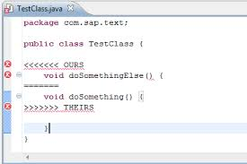

Eis aqui uma história fictícia para ilustrar como é o dia a dia de quem trabalha com Git e GitHUb.

Este artigo iniciou-se na [matéria anterior](/git/como-e-trabalhar-com-git-1/), porém não há uma ligação profunda entre
as duas matérias.

Anteriormente, para descobrir o branch atual eu executei `git status`. OK, isso funciona, porém o mais correto
(para descobrir qual é o branch ativo) seria o comando abaixo.

    git branch

Ele lista todos os branchs locais e coloca um asterisco no branch ativo.

__O que é um branch?__ No dicionário, branch significa: ramo, galho, ramificação, bifurcar, separar, etc... Sim, é tudo
isso, porém a tradução mais comum é __ramificação__. Um branch é uma maneira de dizer "quero trabalhar em uma nova
funcionalidade mas sem interromper os trabalhos principais". O trabalho principal conhecemos como __master__ e as novas
funcionalidades (features, issues, etc...) colocamos os nomes que acharmos mais adequado.

A imagem acima ilustra um ramo (branch). Só não confunda a direção das setas, você deve ir em sentido contrário. Repare
que, em nossa linha de tempo, o passado (old base) fica mais a esquerda, este é o nosso ponto de partida. A direção é
da esquerda para a direita e conforme avançamos na linha do tempo, mais para o direita estaremos.

Se branch é um conceito obscuro para você, então faça uma pausa e leia mais sobre branchs.

Continuando, se eu listo os branchs com `git branch` então com `git checkout` eu troco de branch.

    git checkout nome-do-branch

Neste instante, aparece uma novo requisito para desenvolvermos e vamos fazâ-lo em um novo branch.

Crie o seu branch.

    git branch new-issue

Liste os branchs (`git branch`), repare que criar um branch não ativa ele automaticamente, você deve fazer isso com o
__checkout__.

    git checkout new-issue

São dois passos, mas há um atalho.

    git checkout -b new-issue

O comando acima cria o branch e imediatamente torna-se seu branch ativo.

Seguimos trabalhando em nossa nova funcionalidade, a sequência de comandos abaixo, aos poucos, deve se tornar uma rotina.

    git add .
    git commit -m ""

Vimos eles na matéria anterior.

De repente, o cliente liga e lhe informa sobre um bug no sistema. Você não pode resolver o bug em seu branch atual
pois as você ainda não terminou seu trabalho, o que fazer agora?

Vamos voltar para o branch principal (master) e resolver o bug lá.

    git checkout master

Após agluns commits, resolvemos o bug. Agora podemos continuar com nossa funcionalidade, vamos voltar para ela.

    git checkout new-issue

Você não precisa, mas sabe que pode atualizar seu novo-branch com o branch master. Você poderia fazer isso mais tarde,
o quanto antes fizer mais fácil será. Igualamos os branch com o comando `merge`.

    git merge master

O comando acima está dizendo *"pegue as últimas alterações do branch master e atualize o branch atual (new-issue)"*.

Agora podemos continuar em nosso branch, após mais alguns commits resolvemos publicar nosso trabalho no repositório
remoto. Mas antes de empurrar (push) devemos atualizar puxando (pull) as alterações de nossos colegas.

    git pull origin new-issue

Só que nesse pull nós não fomos feliz e deu __conflito__. Tudo bem, o negócio é simples! Eu e meu colega mexemos na
mesmíssima parte de código e então o git ficou com uma dúvida: "o que eu faço, fico com o seu trabalho ou o do seu amigo?".

O git nos informa onde está o problema adicionando alguns caracteres, como ilustrado na figura abaixo.

Basta deletar os caracteres, escolher qual é o código correto e "comitar" novamente, pronto!

Resolvido os conflitos, preciso disponibilizar os trabalho para meus colegas.

    git push origin new-issue

E assim termina mais uma tarde.

Revendo os comandos
---

Para listarmos os branchs e descobrir qual está ativo:

    git branch

Para trocar de branch:

    git checkout nome-do-branch

Para criar um branch, são dois passos:

    git branch new-issue
    git checkout new-issue

Mas há um atalho:

    git checkout -b new-issue

Para igualar o branch atual com determinado branch:

    git merge issue53

Supondo que o branch atual seja o __master__, o comando acima diz: "atualize o master com o branch issue53".

__Também aprendemos como resolver conflitos!__

Leia também
---

O artigo anterior [Como é trabalhar com Git - parte 1](/git/como-e-trabalhar-com-git-1/)