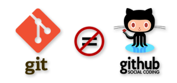
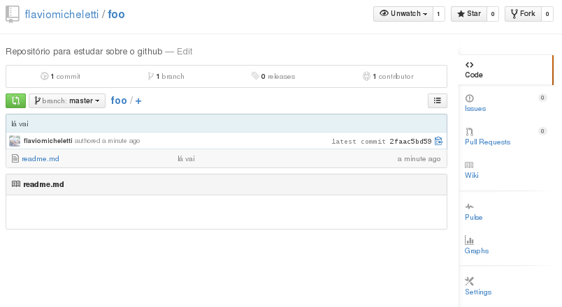

Esta é uma introdução prática ao Git e GitHub, indicado para quem está dando os primeiros passos com o Git. Neste artigo
nós veremos como:

- Criar um repositório localmente
- Adicionar (add) e comitar (commit)
- Criar um repositório no GitHub
- Conectar o repositório local com o repositório público
- Sincronizar ambos os repositórios

Antes de tudo, é preciso saber que Git não é GitHub.

[Git]() é um sistema distribuído de controle de versão de código.

[GitHub]() é o local onde você hospeda o seu Git na web.

Você não está preso ao GitHub, existe uma infinidade de outros "hospedeiros", alguns pagos outros gratuitos. O GitHub é
gratuíto para projetos abertos e pago para projetos privados.

Antes de iniciar com o Git, seria bom se você entendesse o conceito de __versionamento de código__, mas talvez você
esteja justamente experimentando o Git para poder entender o que é versionamento, então vamos lá...

### Criando um repositório local

Antes de criar o repositório você deve criar um pasta para ele, obviamente.

Para criar uma nova pasta no Linux executamos `mkdir nome-da-pasta`.

Você entra nela, ou melhor, vai até ela `cd nome-da-pasta`.

Agora é só criar o repositório

    git init

Para testar, pergunte ao Git sobre o status do repositório `git status`.

O resultado deve ser parecido com isto...

    # On branch master
    #
    # Initial commit
    #
    nothing to commit (create/copy files and use "git add" to track)

"Nada para comitar"... bom, então vamos inserir um arquivo e "comitar".

### Adicionado e comitando

Considerando que você já criou o seu repositório Git e está na pasta do repositório.

Você deve criar um arquivo qualquer, utilize seu editor de texto ou então utilize o comando seguinte.

    touch readme.md

O comando touch é um utilitário do Linux.

Antes de comitar, devemos adicionar, a sequência é sempre esta:

- Adicionar (`add`)
- Comitar (`commit -m "mensagem"`)

Veja os comandos:

    git add readme.md
    git commit -m "my first commit"

### Criando um repositório no GitHub

Primeiro, crie um conta no GitHub.

Utilize um nome de guerra que transmita seriedade, ele será visto por todos, inclusive seu futuro empregador.

Agora procure o ícone com um sinal de mais (+) chamado "Create new...".

Defina um nome para seu novo repositório.

Por enquanto, ignore as outras opções. Depois, com calma, você mesmo aprenderá sobre elas.

Como seu repositório está vazio, o GitHub lhe dará algumas dicas, sua tela deve parecer-se com esta:

Apenas anote a URL exibida no campo __HTTP__, vamos precisar dela daqui a pouco.

Agora, temos um repositório no GitHub e um localmente, então vamos conectá-los.

### Conectando o repositório local com o da web

O seu QG (quartel general) é o seu repositório local. A partir dele, você enviará ou receberá informações do repositório
na web (no GitHub).

Para "conectar" os repositórios executamos o comando abaixo.

    git remote add origin https://github.com/flaviomicheletti/github-foo.git

Onde __origin__ signifca um apelido para seu repositório, poderia ser qualquer outro nome.

E no lugar da minha URL você deve utilizar a sua URL, eu avisei que precisaríamos dela!

Para testar, execute `git remote -v`, sua tela deve ser parecida com a seguinte:

    origin	https://github.com/flaviomicheletti/github-foo.git (fetch)
    origin	https://github.com/flaviomicheletti/github-foo.git (push)

### Sincronizando os repositórios

Você já criou um repositório local e outro no GitHub.

Já adicionou alguns arquivos e "comitou" algumas modificações (localmente).

O seu repositório local já está conectado com o da web (possui uma referência para ele).

Agora só falta enviar as informações do repositório local para o repositório na web (no GitHub):

    git push origin master

Lembrando que __origin__ é o apelido para seu repositório na web e __master__ é o seu branch principal.

Se você acabou de instalar o Git, talvez tenha se esquecido das configurações globais.

Configure seu email e nome que serão exibidos em cada commit.

    git config --global user.name "Seu nome para exibição"
    git config --global user.email "seu-email@email.com"

Você deve configurar antes de realizar o  __push__.

### Fechando a conta

Se tudo deu certo, acesse novamente (ou atualize) a página de seu repositório, você deve estar vendo algo parecido
com a figura abaixo.

Este [repositório](https://github.com/devfuria/foo) existe de verdade!

Eu criei ele para você poder treinar, bagunçar, testar, brincar, fazer o que você quiser com ele,
sem a preocupação de acertar.

Só não pode não fazer nada, então vamos praticar....

Faça um __fork__ do projeto, crie um arquivo de texto qualquer com alguma mensagem tipo "oi, me chamo... e passei por aqui"
e envie através de um __pull request__.