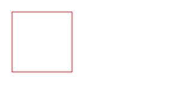
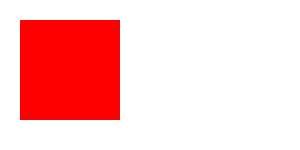
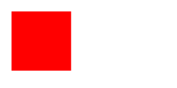
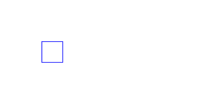

Existem 4 métodos para desenharmos um retângulo: `strokeRect()`, `fillRect()`, `clearRect()` e `rect()`.

Todos os métodos esperam 2 argumentos, na verdade 4, que especificam um canto do retângulo, seguidos de sua largura e altura.

Veja a assinatura das funções abaixo.

```javascript
strokeRect(x, y, width, height)
fillRect  (x, y, width, height)
clearRect (x, y, width, height)
rect      (x, y, width, height)
```

"Normalmente especificamos o canto superior esquerdo e, então, passamos um valor de largura e altura positivos, mas 
também podem ser negativos."
(David Flanagan)

A imagem abaixo ajuda a entender melhor o esquema.

<p></p>


O método strokeRect()
---

Desenha o contorno (mas não preenche o intrerior) de um retângulo com a posição e o tamanho especificados.

A cor e a largura da linha são especificados pela propriedades `strokeStyle` e `lineWidth`.

A aparência dos cantos do retângulo é especificada pela propriedade `lineJoin`.

<p></p>


```javascript
var canvas = document.getElementById('ex01');
var context = canvas.getContext('2d');
context.strokeStyle = 'red';
context.strokeRect(20,20,100,100);
```


O método fillRect()
---

Preenche o retângulo especificado com a cor, gradiente ou padrão definido pela propriedade `fillStyle`.

<p></p>

```javascript
var canvas = document.getElementById('ex02');
var context = canvas.getContext('2d');
context.fillStyle = 'red';
context.fillRect(20, 20, 100, 100);
```


O método clearRect()
---

Preenche o retângulo especificado com preto transparente.

<p></p>

```javascript
var canvas = document.getElementById('ex03');
var context = canvas.getContext('2d');
context.fillStyle = 'red';
context.fillRect(20, 20, 100, 100);
context.clearRect(40, 40, 60, 60);
```


O método rect()
---

Adiciona um retângulo no path (caminho). Esse retângulo é ele próprio um subcaminho (subpath) e não está conectado a 
outro subcaminho (subpath).

Quando este método retorna a posição atual é a coordenada (x, y) inicial.

<p></p>

```javascript
var canvas = document.getElementById('ex04');
var context = canvas.getContext('2d');
context.strokeStyle = 'red';

context.beginPath();
context.rect(20, 20, 100, 100);
context.stroke();
```

Abaixo vemos o mesmo exemplo acrescentado do método `fill()`.

<p></p>

```javascript
var canvas = document.getElementById('ex05');
var context = canvas.getContext('2d');
context.strokeStyle = 'red';
context.fillStyle = 'red';

context.beginPath();
context.rect(20, 20, 100, 100);
context.stroke();
context.fill();
```


A diferença entre fillRect() e rect
---

Os métodos `fillRect()` e `rect()`, visualmente, parecem produzir o mesmo efeito.

Mas os resultados são diferentes.

O método `fillRect()` NÂO influencia no path (caminho).

O método `rect()` SIM, influencia no path (caminho).

Saiba que:

__Não influencia o path:__

* `strokeRect`
* `fillRect`
* `clearRect`

__Influencia o path:__

* `rect`

Vamos para exemplos práticos.


### Exemplo 01

<p></p>

O método strokeRect não influencia o caminho (path). A prova é o canvas do exemplo 01.

Veja que os métodos `lineTo` e `stroke` não tiveram efeito algum, só vemos o retângulo no canvas.

```javascript
var canvas = document.getElementById('ex06');
var context = canvas.getContext('2d');
context.strokeStyle = "blue";

context.strokeRect(60, 60, 30, 30);
context.lineTo(10,10);
context.stroke();
```


### Exemplo 02

Agora se trocarmos o método `strokeRect` pelo método `rect` a linha surge como em um passe de mágica.

Mas não tem mágica não, explico. O método `rect` influencia no caminho (path). Repare que desenhamos o retângulo nas 
coordenadas (x=60, y=60). A mágica está aí, o pincel foi deslocado até a coordenada (x=60, y=60). É como se tivéssemos 
chamado o método `moveTo(60, 60)`.

O método seguinte (`lineTo(10,10)`) cumpre seu papel corretamente, pois ele desenha-rá uma linha até a coordenada 
(x=10, y=10). E adivinha a coordenada de origem? Isso mesmo, (x=60, y=60).

<p></p>

```javascript
var canvas = document.getElementById('ex06-1');
var context = canvas.getContext('2d');
context.strokeStyle = "blue";

context.rect(60, 60, 30, 30);
context.lineTo(10,10);
context.stroke();
```


### Exemplo 03

Ainda não caiu a ficha? Não tem problema temos mais este exemplo para clarear as coisas.

Ele é igual ao exemplo 01, mas ao adicionar-mos a função `moveTo` (veja sublinhado) ele se comporta exatamente como o exemplo 02.

<p></p>

```javascript
var canvas = document.getElementById('ex06-2');
var context = canvas.getContext('2d');
context.strokeStyle = "blue";

// mova o pincel até (60,60) e desenhe um retângulo
context.strokeRect(60, 60, 30, 30);
// mova, novamente, o pincel até (60,60)...
context.moveTo(60, 60);
// ... e desenha uma linha até (10,10)
context.lineTo(10,10);
// pinte o caminho
context.stroke();
```

