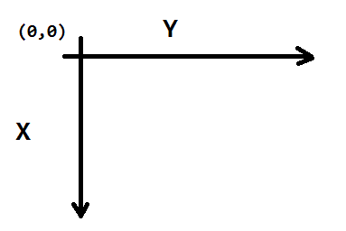
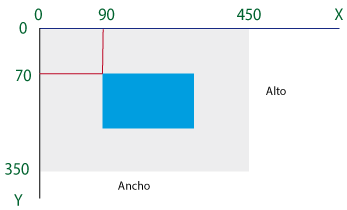
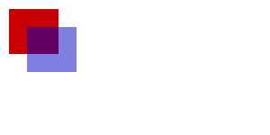

### O que é canvas?

Uma tela bitmap de resolução dependente que pode ser usada para renderizar gráficos, jogos, ou outras imagens em tempo real
(WHATWG).

A tag canvas é um retângulo na sua página, onde você pode usar JavaScript para desenhar o que você quiser
(Mark Pilgrim ).


### Sobre o contexto!

Todo canvas tem um contexto de desenho, utilizamos a função `getContext()` do objeto canvas para recuperar o contexto.

A especificação prevê dois contextos: 2d e 3d.

Devemos passar a opção como `string`.

    var context = canvas.getContext('2d');

ou

    var context = canvas.getContext('3d');

O primeiro contexto a ficar maduro foi o bidmensional (2d). É nele que vamos concentrar nossos esfoços. 


### Sobre o path (caminho)

> Cada canvas possui um path (caminho).
>
> Defnir o path é como desenhar com um lápis. Você pode desenhar o que quiser mas ele não será parte do produto finalizado até que você pegue a pena e trace sobre seu path com tinta
>
> Mark Pilgrim 

Utilizamos a função `beginPath()` do objeto contexto para iniciar um path (caminho) ou subcaminho (subpath).


### Desenhando a tinta

Para imprimir o path (caminho) no canvas usamos o método stroke()

O stroke() é um dos métodos "tinta". Ele pega o path complexo que você definiu com todas aquelas chamadas moveTo() e lineTo() e realmente as desenha no canvas.
(Mark Pilgrim)


Primeiros passos
---

Olhando para o arquivo HTML, podemos afirmar que o canvas nada mais é do que um elemento DOM.

Ele precisará de um `id` para referenciarmos com o Javascript.

Eu defini os tamanhos `315x150`, mas esse já é o tamanho padrão do canvas.

    <canvas id='myCanvas' width='300' height='150'>

Sozinho, ele não produz efeito algum. Precisamos de algum código em Javascript para vermos o elemento canvas entrar em ação

Abaixo temos um HTML de exemplo para você poder começar a utilizar o canvas.


```html

<!DOCTYPE html>
<html>
    <head>
        <title></title>
        <style>
            canvas {
                background: #ffffff;
                cursor: pointer;
                margin-left: 10px;
                margin-top: 10px;
                -webkit-box-shadow: 4px 4px 8px rgba(0,0,0,0.5);
                -moz-box-shadow: 4px 4px 8px rgba(0,0,0,0.5);
                box-shadow: 4px 4px 8px rgba(0,0,0,0.5);
            }
        </style>
    </head>
    <body>
        <canvas id='myCanvas' width='300' height='150'>
            Canvas not supported
        </canvas>
        <script>
            var canvas = document.getElementById('myCanvas');
            var context = canvas.getContext('2d');

            //
            // aqui entrará o seu javascript que manipulará o elemento canvas
            //

        </script>
    </body>
</html>
```


### Obtendo o contexto

Para comerçar a executar o canvas, precisamos do contexto.

E para obter o contexto precisamos primeiro encontrar o elemento canvas.

Aqui temos uma referência ao elemento canvas.

    var canvas = document.getElementById('myCanvas');

E agora sim temos o objeto canvas, o contexto.

    var context = canvas.getContext('2d');


Esquema das coordenadas
---



O canvas trabalha como um "gráfico x y" sobre o plano cartesiano.

Só que o ponto x = 0 e y = 0 está no canto superior esquerdo.

É como se estivéssemos olhando para o quadrante inferior direito (4 quadrante) do plano cartesiano.


 Se você já trabalhou com algo parecido, como por exemplo a __biblioteca GD__, se sentirá em casa.

Caso contrário, pode ser que leve um tempo para se acostumar.

Veja outros exemplos





Exemplos
---

### MDN

Abaixo temos o exemplo básico da MDN.

<p></p>


```javascript
var canvas = document.getElementById('ex01');

if (canvas.getContext) {
    var context = canvas.getContext("2d");

    context.fillStyle = "rgb(200,0,0)";
    context.fillRect(10, 10, 55, 50);

    context.fillStyle = "rgba(0, 0, 200, 0.5)";
    context.fillRect(30, 30, 55, 50);
}
```  


### The Cloth Simulation

Andrew Hoyer é o maluco que fez isso [http://andrew-hoyer.com/experiments/cloth/](http://andrew-hoyer.com/experiments/cloth/)

Para ver o código [https://github.com/ndrwhr/cloth-simulation](https://github.com/ndrwhr/cloth-simulation)


### Fontes

- [Uso básico do canvas (MDN)](https://developer.mozilla.org/en-US/docs/Web/Guide/HTML/Canvas_tutorial/Basic_usage)
- [Capítulo 4 do livro "HTML5 Entendendo e Executando"](http://diveintohtml5.com.br/canvas.html) disponível para consulta na web, traduzido pela comunidade.

