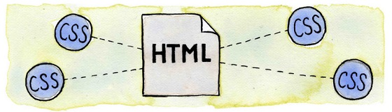

Se você acompanhou os primeiros capítulos deste compêndio, já se deparou com o objeto deste artigo.

Por tanto, estamos fazendo um breve revisão só para termos certeza de que o assunto não passou despercebido.

Neste artigo, vamos aprender como unir a CSS ao documento HTML.

"Colamos" o CSS ao HTML de 3 formas distintas: inline, embeded e linked:

+ folhas externas (linked)
+ folhas internas (embeded)
+ estilos inline  (inline)


## CSS - inline (na linha)

CSS inline o método mais simples, declaramos a regra com o emprego do atributo `style` do HTML, exemplo:

```html
<!DOCTYPE html>
<html lang="pt-br">
    <head>
        <title>Título da página</title>
        <meta charset="utf-8">
    </head>
    <body>

        <h1>Um título qualquer</h1>
        <p style="font-size: 12px; color#767676">primeiro parágrafo</p>
        <p style="font-size: 12px; color#767676">segundo parágrafo</p>
        <p style="font-size: 12px; color#767676">terceiro parágrafo</p>

        <h2>Outro título qualquer</h2>
        <p style="font-size: 12px; color#767676">quarto parágrafo</p>
        <p style="font-size: 12px; color#767676">quinto parágrafo</p>
        <p style="font-size: 12px; color#767676">sexto parágrafo</p>

    </body>
</html>
```

O leitor atento notou que tivemos que repetir a regra em cada parágrafo. Essa forma além de repetir código, não ajuda na
legibilidade e NÂO permite o controle centralizado da CSS. Programadores e designs, no geral, evitam o CSS inline. Ainda
não "dá cadeia" utiliza CSS inline, se achar que precise dele, pode usá-lo com bom censo.


## CSS - embeded (incorporadas)

Coloca-se as regras de CSS entre a tag `style` na seção head do HTML, veja o exemplo:

```html
<!DOCTYPE html>
<html lang="pt-br">
    <head>
        <title>Título da página</title>
        <meta charset="utf-8">
        <style type="text/css" media="all">
        p {
            font-size: 12px;
            color: #767676;
        }
        </style>
    </head>
    <body>

        <h1>Um título qualquer</h1>
        <p>primeiro parágrafo/p>
        <p>segundo parágrafo</p>
        <p>terceiro parágrafo</p>

        <h2>Outro título qualquer</h2>
        <p>quarto parágrafo</p>
        <p>quinto parágrafo</p>
        <p>sexto parágrafo</p>

    </body>
</html>
```

Já é bem melhor que o método anterior: já é possível localizar o CSS com mais facilidade no documento.

Mas há o método campeão...


## CSS - linked (externos)

Coloca-se as regras de CSS em um arquivo separado do HTML, normalmente a extensão do arquivo é `.css`.

A "cola" é realizada através da tag `link`, veja código de exemplo:

```html
<!DOCTYPE html>
<html lang="pt-br">
    <head>
        <title>Título da página</title>
        <meta charset="utf-8">
        <link rel="stylesheet" type="text/css" href="estilos.css" media="all" />
    </head>
    <body>

        <h1>Um título qualquer</h1>
        <p>primeiro parágrafo/p>
        <p>segundo parágrafo</p>
        <p>terceiro parágrafo</p>

        <h2>Outro título qualquer</h2>
        <p>quarto parágrafo</p>
        <p>quinto parágrafo</p>
        <p>sexto parágrafo</p>

    </body>
</html>
```

Eis o arquivo que compõem a folha de estilo `estilos.css`.

```css
/* Folha de estilo: estilos.css */
p {
    font-size: 12px;
    color: green;
}
```


Agora sim temos um método profissional, todo CSS fica em arquivo separado que é incluso no HTML através de uma única linha.


## Conclusão

Há vantagens e desvantagens em cada um dos métodos, discutiremos isso em breve, por hora saiba que esse é o método mais
adequado e por essa razão o que mais utilizaremos no curso, porém não leve tudo a ferro-e-fogo: lance mão das 3 formas
quando e onde achar melhor.

Leia o próximo artigo [Seu alvo é o HTML, sua arma é o CSS](../seu-alvo-e-o-html-sua-arma-e-o-css/).

