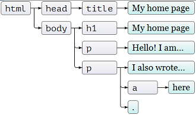

Um documento HTML compõem uma estrutura __DOM__, todo HTML possue uma árvore DOM.

DOM é um acrônimo para Document Object Model (Modelo de Objetos de Documento).

Pense nele como uma árvore mesmo, veja a figura abaixo....



Obtemos acesso ao documento HTML através do DOM, voce defini um seletor de CSS tendo o DOM funcionando como um mapa do
documento HTML, ele irá guiar voce através dos elementos.

Um exemplo pode nos ajudar a entender melhor, o código abaixo...

```html
<!DOCTYPE html>
<html>
    <head>
        <title>Sample Document</title>
    </head>
    <body>
        <h1>An HTML Docuemnt</h1>
        <p>This is a <i>simple</i> document</p>
    </body>
</html>
```

.. gera-rá a seguinte árvore DOM:


Dentro de cada elemento temos os __nó__ de texto.

Abaixo vemos outro exemplo da árvore DOM, repare que os nós de texto também foram incluídos.


## Conclusão

Mas afinal, para que serve esse negócio ?

O entendimento do DOM é essencial para trafegar (se movimentar) por entre os elementos HTML.

Quando você pensa em "atingir" um elmento com seletores CSS, você pensa através do DOM.

É através do DOM que você consegue "mirar" no elemento.

Quando você estiver estudando JavaScript também se utilizará do DOM, pois não é só o CSS que precisa atingir elementos
HTML, o JavaScript também tem essa necessidade.

Tenha a certeza de ter um bom domínio do DOM! Para ficar bom, só praticando!
