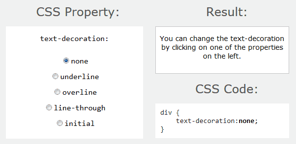

| <a href="../estilizando-a-fonte-do-documento/">artigo anterior</a> | <a href="../">index</a> |
 

O segundo conjunto de propriedades que iremos aprender altera o texto do documento.

Lembrando que aqui é o resumo do resumo, voltaremos a tratar do assunto brevemente.

- `text-align: [left, center, right, justify]`
- `text-indent: [um tamanho qualquer]`
- `text-decoration: [underline, overline, line-through ou blink]`
- `letter-spacing: [um tamanho qualquer]`
- `line-height: [um tamanho qualquer]`

A propriedade __text-align__ controla o alinhamento horizontal do texto.

A propriedade __text-indent__ controla a quantidade de espaço (em branco) colcado antes da primeira linha em um bloco.

A propriedade __text-decoration__ aplica uma discreta formatação no texto (vide imagem acima).

A propriedade __text-spacing__ controla o espaçamento entre caracteres.

A propriedade __text-height__ controla a altura da linha.

Como __exercício__, tente alterar o estilo desta página (use o plugin do navegador) explorando as propriedades acima apresentadas.

Vamos ver o [próximo artigo](../estilizando-dimensionamentos-espacamentos-margens-e-bordas).