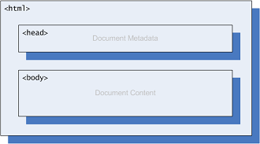
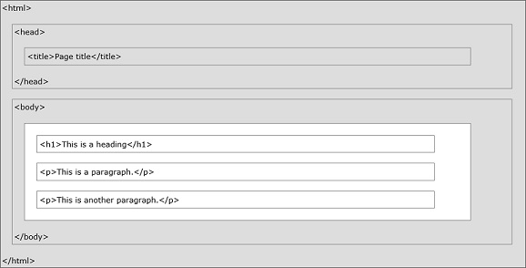

Chegou a hora de aplicarmos o conhecimento adiquirido colocando a mão na massa e se sujando um pouco.

Antes eu gostaria de repassar com você a estrutura básica de uma qruivo HTML...

A imagem abaixo ilustra o esqueleto de uma página HTML:



Ela deve ser memorizada por você e mais do que isso, deve fazer sentido para você, pois:

- Dentro do cabeçalho (head) teremos informações sobre a página
- Dentro do corpo (body) teremos o conteúdo
- Todo HTML começa e termina com a tag `<html>`.
- Todo HTML deve ter as tags `<head>` e `<body>`.

Precisamos detalhar um pouco mais essa questão, veja na imagem abaixo uma estrutura básica:



A tag `<head>` conterá um título (`<title>`) e alguns __metadados__.

O único metadado obrigatório é o referente a codificação de caracteres (`<meta charset="UTF-8">`), falaremos dele em breve.

A tag `<body>` deverá conter todo o conteúdo de sua página.

Abaixo vemos a estrutura básica e mínima de um HTML.

```html
<!DOCTYPE html>
<html lang="pt-br">
    <head>
        <title></title>
        <meta charset="utf-8">
    </head>
    <body>
    </body>
</html>
```

Temos também o palavrão `<!DOCTYPE html>` antes de tudo, falaremos dele em breve.

Lembre-se também que um arquivo HTML é nada mais que um arquivo de texto simples definido com a extensão `.html` ou
`.htm`, ambas funcionam.


## Desafio

E agora chegou a hora, vamos [construir seu primeiro HTML](../seu-primeiro-html/) ?
