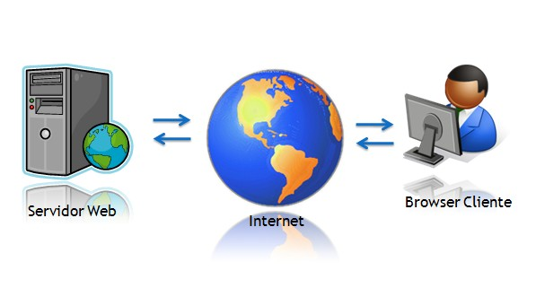

A Apache é um servidor web, isso significa que ele irá servir nossas páginas HTML.

Ele responde pelas requisições HTTP.

Sua instalação e configuração fogem do escopo deste curso, apesar que
[aqui no devfuria](https://www.google.com.br/search?q=devfuria.com.br+apache&gws_rd=cr&dcr=0&ei=GaMJWrWNNMGAwgTa6bOICg)
  você encontrará algumas boas dicas sobre o Apache.

## O que é um servidor web ?

Servidor web é um negócio que fica servindo páginas web. Ele guarda seus documentos HTML, imagens, folhas de estilos (CSS)
e os entrega para o dispositivo do usuário final.

Você precisa conhecer um servidor web!

Tente baixar os arquivos e instalar em seu computador!

## E depois que eu instalei ?

Ao instalar o Apache localmente (na sua máquina local) você poderá acessar suas páginas através do seguinte endereço...

    http://localhost

O endereço acima apontará para o seu __documentroot__ que é o local onde devem ficar armazenados seus arquivos HTML.

No Windows você pode salvar um arquivo de texto qualquer com a extensão `.html` e pedir para o navegador abrir.

Depois de criar e testar seus arquivos, você irá querer publicar eles na web.

## Como publicar publicar arquivos na Internet ?

Fazemos isso através do protocolo FTP e com a ajuda de algum softwarer que seja capaz de manipular o FTP.

Há tanta coisa para você aprender sobre o Apache, mas por hora eu queria apenas mostrar a você um pequeno detalhe:

Abaixo vemos um print da tela do software FileZilla, ele é um client (cliente) que atuliza o protocolo FTP para ajudar
a você a fazer donload ou upload de seus arquivos para seu servidor.

Ele é a ponte ente o servidor e sua máquina!

## Um exemplo real

Este arquivo que você está lendo chama-se `index.html` e está dentro da pasta `o-basico-sobre-servidor-web/`.

Portanto, o caminho completo é `o-basico-sobre-servidor-web/index.html`

Se você observar na URL de seu navegador, verá que o fragmento `index.html` foi suprimido.

É que o __servidor web__ faz uma "tradução" de `o-basico-sobre-servidor-web/` para `o-basico-sobre-servidor-web/index.html`.

Experimente acessar as duas formas...

- [o-basico-sobre-servidor-web/index.html](/html-css/o-basico-sobre-servidor-web/index.html)
- [o-basico-sobre-servidor-web/](/html-css/o-basico-sobre-servidor-web/)

Viu como tanto faz?

Em breve voltaremos a falar mais sobre servidores web!

## Teste seus conceitos

Nós não vimos todos os conceitos abaixo (ainda), mas você pode procurar na Internet o significado de cada um deles.

1. O que é um cliente (client) ?
2. O que é um servidor ?
3. O que é a arquitetura cliente/servidor ?
4. O que é número IP ?
5. O que significa "seu domínio" ?
6. O FTP é o servidor ?
7. O que esse tal de FTP ?
8. O que é URL ?
