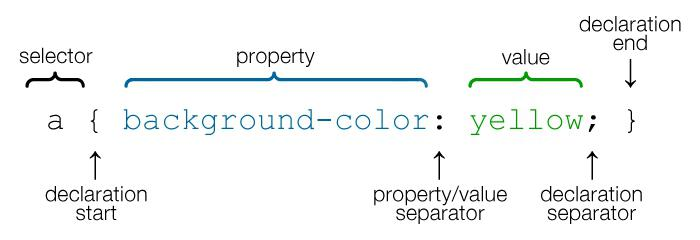

No [artigo anterior](../adicionando-css-ao-html/) nós vimos como unir o CSS ao HTML, neste artigo veremos
como atingir os elementos HTML.



Em outras palavras, para poder estilizar um determinado elemento HTML utilizando CSS, você precisa ter <br />
uma maneira de selecionar esses elementos. Na CSS a parte de uma regra de estilo que faz isso é chamada de __seletor__.

Os mais básicos são:

- Seletor tipo
- Seletor de classe
- Seletor id


## Seletor tipo (tags)

É o seletor mais abrangente da CSS, ele casa com todos os elementos encontrados, exemplo:

```css
h1 {
    font-size: 20px;
}
p {
    font-size: 10px;
}
```

Os estilos acima irão refletir em todos o elementos `p` e `h1` da página.

### Agrupamento de seletores

Para aplicar uma regra CSS comum a vários seletores você pode agrupá-los.

Abaixo vemos algumas regras em comum.

```css
h1 {color: red;}
h2 {color: red;}
p {color: red;}
```

Aqui elas foram agrupadas.

```css
h1, h2, p {color: red;}
```


## Seletor de classe

Podemos aplicar o seletor ao atributo `class` de qualquer elemento HTML.

Se a intenção é aplicar a mesma regra CSS a diferentes elementos, você pode utilizar um __seletor de classe__, <br>
segue exemplo:

```html
<p class="diferente">Este parágrafo sairá diferente por causa da estilização</p>
```

A CSS deve começar com um `.` (ponto) imediatamente seguido pelo nome da classe, veja:

```css
.diferente {
    color: black;
}
```

## Seletor id

O identificador `id` pode ser aplicado a maioria dos elementos HTML só que ele deve ser único em sua página.

```html
<div id="main">...</div>
```

A CSS deve ser precedidada pelo sinal `#` e imediatamente seguida pelo nome, veja:

```css
#main {}
```