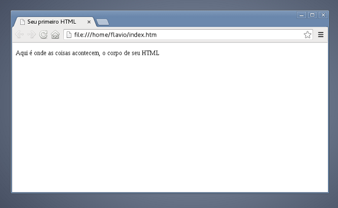

Vamos criar o seu primeiro arquivo HTML.

```html
<!DOCTYPE html>
<html lang="pt-br">
    <head>
        <title>Seu primeiro HTML</title>
        <meta charset="utf-8">
    </head>
    <body>
        <p>Aqui é onde as coisas acontecem, o corpo de seu HTML</p>
    </body>
</html>
```

Você deve abrir um editor de texto simples e inserir o conteúdo apresentado acima.

Salve o arquivo com a extensão `.html` ou `.htm` e abra o arquivo com seu navegador web preferido (espero que não seja
o IE), <br> o resultado deve ser parecido com o abaixo:



E aí, tranquilo ? Conseguiu fazer ? Conseguiu visualizar no navegador ?

Aposto que sim! Então vamos para o próximo desafio...


## Desafio

Imagine que você possue um conteúdo pré determinado de um site em suas mãos.

Seu objetivo é determinar qual a marcação ideal para esse conteúdo.

A minha pergunta desafio é....

Qual marcação será mais adequado para o conteúdo proposto ?

O objetivo é inspirá-lo(a) na direção de construir um HTML de primeira qualidade

[Aceito o desafio!!!](../criando-um-html-de-primeira-qualidade/)

