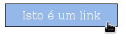

Sem links a web não faria sentido.

São eles que permitem que você siga um rastro de informações de uma página web à próxima e de uma idéia à outra, 
independente do local em que se encontra o servidor do site.

```html
<a href="pagina-ao-clicar.html">Isto é um link</a>
```

O link possui a propriedade `href` (hypertext reference) que nada mais é do que o alvo que será alcançado quando
clicarmos no link.

Esse alvo pode ser uma outra página html ou um script de servidor em php, por exemplo.

Pode até apontar para uma imagem ou outro arquivo qualquer (e então o navegador perguntará se o usuário quer fazer o
download ou abrí-lo com algum programa).

O alvo pode estar em um nível hierárquico diferente, para baixo ou para cima.

Trata-se do __endereço relativo__. Vamos para baixo, de pasta em pasta, com o símbolo `../` exemplo:

```html
<a href="../../../pagina-ao-clicar.html">Isto é um link 3 pastas abaixo</a>
```

E para cima, com o nome da pasta, exemplo:

```html
<a href="pasta/pasta/pasta/pagina-ao-clicar.html">Isto é um link três pastas acima</a>
```

Na __URL__ da âncora também podemos passar parâmetros com um par de valor, onde o primeiro valor é o nome da variável e
o segundo é o valor dessa variável (mas isso nos veremos mais afundo quando estivermos estudando uma linguagem 
"do lado do servidor"), exemplo:

```html
<a href="script.php?varA=valor1&varB=valor2">Isto é um link com dois parâmetros</a>
```


Estilizando
---

O link pode sofrer estilizações interessantes. É muito comum estilizar o link como se fosse um botão e há também um efeito
que é acionado quando passamos o mouse por cima: é o __hover__ (por cima, pairar). Para isso utilizamos pseudoclasses
em CSS, boa hora para você entender como funcionam.

- O seletor de pseudoclasse `:link` afeta links que não foram visitados
- O seletor de pseudoclasse `:visited` afeta links visitados
- O seletor de pseudoclasse `:hover` afeta links quando o mouse é posicionado sobre
- O seletor de pseudoclasse `:active` afeta links quando ele é ativado (clique e segure)


O mais comum é desativar o sublinhado e reativá-los quando o mouse é posicionado sobre eles, veja a CSS:

```css
a:link, a:visited {text-decoration: none}
a:hover, a:active {text-decoration: underline}
```


Você pode querer transformar seu link em um botão. Para tal, utilize a propriedade `display` como `block`.

A primeira parte da regra de CSS abaixo refere-se a questão mais estrutural do botão e a segunda parte refere-se mais a
a questão de estética.

```css
a {
  /* primeira parte */
  display: block;
  width: 150px;
  padding: 5px;
  line-height: 1.4em;
  
  /* segunda parte */
  background-color: #94B8E9;
  border: 1px solid black;
  color: #000;
  text-decoration: none;
  text-align: center;
}
```


O CSS acima resulta em...


O único comentário vai para a propriedade `line-height`, porque estamos utilizando `line-height` para controlar a altura
do botão em vez de simplesmente `height`? Isso é um truque para centralizar verticalmente o botão. Se fosse configurar
uma altura, você provavelmente teria de utilizar preenchimento para empurrar o texto para baixo e criar uma centralização
vertical falsa. Entretanto, o texto sempre é centralizado verticalmente em uma caixa de linha; portanto, utilizando
`line-heigth`, o texto sempre será posicionado no centro da caixa. Mas há uma desvantagem, se houver duas quebras de
linhas no texto do seu botão, esse botão terá o dobro da altura desejada. A única maneira de evitar isso é dimensionar
seus botões e o texto de tal maneira que o texto não mude de linha. (Andy Budd, Criando Páginas Web com CSS, pág 82)


### Rollover simples

O uso da pseudoclasse `:hover` permite criar efeitos de rollover. Você pode estender o exemplo anterior para incluir
um efeito de rollover muito simples, configurando apenas a cor de fundo e a cor de texto do link quando o mouse é
posicionado sobre ele, veja o exemplo abaixo.



