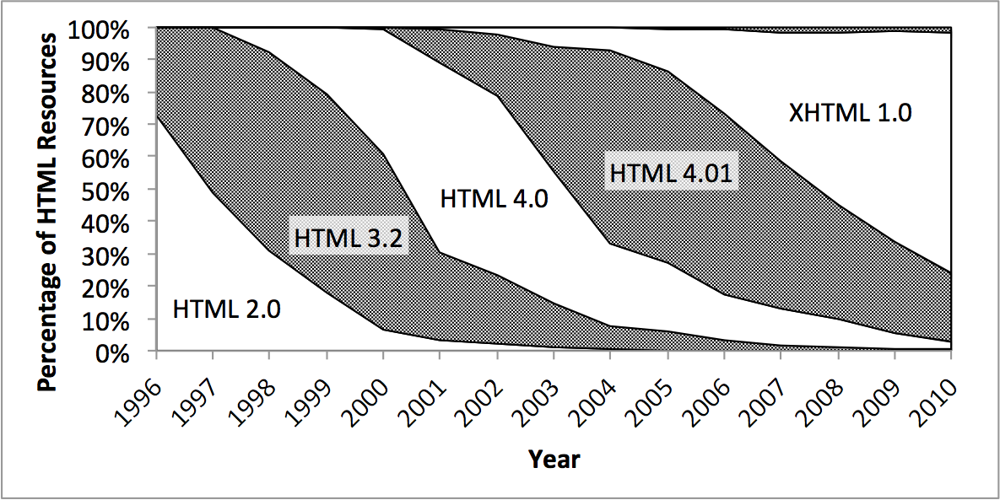

Onde tudo começou
=================

Tim Berners-Lee, a culpa é toda dele. No começo dos anos 90, o dito cujo, inventou o HTML (HyperText Markup Language) que
significa Linguagem de Marcação de Hipertexto. Ele queria facilitar a comunicação de suas pesquisas com seus colegas
e acabou resolvendo o problema de todo mundo, nascia a web.

A idéia era simples e genial, era possível criar e disponibilizar um arquivo de texto simples com conteúdo HTML, via rede,
para outro computador. No computador de destino, um software chamado web-browser (navegador web) era encarregado de exibir
o conteúdo HTML. Não podemos esquecer de mencionar o protocolo HTTP (Hypertext Transfer Protocol, Protocolo de
Transferência de Hipertexto) que também é invenção de Lee e é peça primordial da web.

A web teve um crescimento rápido. Nessa época, "nosso bebê", já tinha pernas e músculos bem desenvolvidos e dava seus
primeiros passos. Não demorou muito para surgirem empresas interessadas na tecnologia, como foi o caso da Netscape. Ela
estava interessada no navegador web e criou um com o mesmo nome da empresa. A Microsof, apesar de atrasada, também
queria sua fatia do mercado e lançou e destemido (ou talvez temido) Internet Explore, vulgo IE.

Essa passagem histórica ficou connhecida como "a guerra dos navegadores", procure na web por esse termo. Nas Faculdades
de tecnologia é muito comum exibirem um filme que deve ter o mesmo nome (não lembro bem). Vale apena assitir. Essa fase
definiu o que conhecemos hoje por Cross-browser, que nada mais é do que a habilidade de construir um site com suporte a
vários navegadores, falaremos dele em breve, apenas adianto que dá para perder alguns cabelos.

Essa é a (humilde, diga-se de passagem) história da Internet. E a história da HTML faz parte dela, mas o que nos
interessa é apenas enteder o HTML e a CSS. Como já disse, a história de ambas é muito interessante e vale a pena aprender
sobre o assunto. A web está cheia de sites e documentos falando à respeito, fica a critério do leitor buscar essas
informações. Por hora, vamos nos deter apenas no universo do HTML e da CSS.

    
    
Tim Berners-Lee, esse é o cara!.

Mas afinal, o que é HTML?
-------------------------

*HTML, originalmente, marca o conteúdo*. Ele faz isso através de sua "etiquetas", ou melhor, através de suas *tag's*.
A tag "p" define um parágrafo, por exemplo. Vejamos algumas tag's bem conhecidas:

+ *html* - define o próprio documento HTML.
+ *head* - define o cabeçalho do documento.
+ *titlte* - define o título.
+ *body* - define o corpo.
+ *h1* - definie o primeiro título(o mais importante).
+ *h2* - definie o segudo título, e assim até o h6.
+ *a* -  define uma âncora, quero dizer, o famoso link.
+ *img* - define uma imagem

As tag's devem ser abraçadas pelos sinais de maior e menor, dessa forma: &lt;nome da tag&gt; e toda tag aberta deve ser fechada.

A barra para direita indica qual é a *tag de fechamento*, exemplo: &lt;p&gt;aqui é um parágrafo&lt;/p&gt;

Abaixo conferimos um arquivo HTML na sua essência:

<h6>HTML(inválido)</h6>
<pre>
&lthtml&gt
    &lthead&gt
        &lttitle&gtTítulo da página&lt/title&gt
    &lt/head&gt
    &ltbody&gt

        &lth1&gtUm título qualquer&lt/h1&gt
        &ltp&gtprimeiro parágrafo/p&gt
        &ltp&gtsegundo parágrafo&lt/p&gt
        &ltp&gtterceiro parágrafo&lt/p&gt

        &lth2&gtOutro título qualquer&lt/h2&gt
        &ltp&gtquarto parágrafo&lt/p&gt
        &ltp&gtquinto parágrafo&lt/p&gt
        &ltp&gtsexto parágrafo&lt/p&gt

    &lt/body&gt
&lt/html&gt
</pre>

Repare que eu coloquei a palavra "inválido" alertando quanto à validade do HTML.
O código acima não é valido e serve apenas para fins didâticos e ilustrativo.

    
    
<a href="http://sigarra.up.pt/up/pt/web_base.gera_pagina?p_pagina=1011879">Fonte da imagem acima</a>

### W3C

Completando a história da HTML: o W3C é um consórcio que regulamenta as especificações tanto do HTML como do CSS. O
W3C é a fonte oficial do HTML e CSS. É possível encontrar as traduções das especificações para a língua portuguesa.
Dois pequenos alertas :  a) Estudar pela especificação é mais difícil (e mais chata também) e b) nem todos os navegadores
implementam as especificações em sua totalidade, isso siginifica que a especificação diz uma coisa e seu navegador
comporta-se de outro, restando para o programador e/ou desginer "se virar" para encontrar um solução.

### HTML, DHTML , XHTML, HTML5, no final das contas é tudo HTML

No início era apenas HTML, depois veio DHTML (o "d" era de Dynamic), depois o XHTML e hoje temos o HTML5.
Sim, são coisas distintas umas das outras, mas em sua essência não passam de mero HTML. Por simplificação, utilizaremos
o termo HTML de forma gernérica e quando for necessário ser mais específico utilzaremos o termo correto.

O HTML5 é a versão mais atual do HTML. O grupo WHATWG ([http://www.whatwg.org/](http://www.whatwg.org/)) não teve a mesma
pasciência que o w3c e saiu na frente com as especificações da tão esperada HTML5. A nova versão excluíu alguns
elementos já defazados, inseriu alguns outros mais "semânticos" e trouxe novidades como videos, armazenamento local,
canvas(uma prancheta para você desenhar via código), geo-location, web off-line, campos com autofoco, placeholders e muito
mais. Se você é novato em HTML talvez não tenha entendido nada do que listamos sobre o HTML5, mas fique tranquilo(a),
veremos HTML concomitante com o HTML5.

    
    
<a href="http://www.webarchive.org.uk/ukwa/visualisation/ukwa.ds.2/fmt">Fonte da imagem acima</a>

E esse tal de CSS?
------------------

CSS (Cascading Style Sheet) determina a estilização do contéudo.
> Folha de estilo em cascata é um mecanismo simples para adicionar estilos
>( por exemplo: fontes, cores, espaçamentos) aos documentos web.
<small>Fonte: W3c</small>

Com a CSS é possível estilizar páginas HTML e assim, separar as obrigações de cada tecnologia:

* A HTML define a estrutura do documento e
* A CSS definie a estilização

A CSS é composta pelo que se chama de "regras de estilização"(rule-sets), um exemplo de regra seria: *"todo parágrafo deve ter o
tamanho da fonte em 12px e sua cor deve ser #767676"*, traduzindo em código css ficaria assim:

<h6>CSS</h6>
<pre>
p {
    font-size: 12px;
    color: #767676;
}
</pre>

A letra "p" é o *seletor*, é o alvo da regra CSS.

Entre as chaves, neste exemplo, há duas propriedades: *font-size*  e *color*.

*12px* e *#767676* são seus respectivos valores.
A regra CSS pode conter várias declarações separadas por ponto e vírgula.

Obs: #767676 é um  hexadecimal representando uma cor (um cinza escuro). Há outras formas de referênciar as cores,
voltaremos nelas em breve.

Se uma imagem vale por mil palavras, vou lhe mandar 4 imagens, espero que valham 4 mil palavras...

    
    
<a href="http://www.sleddogstudio.com/webdesign/lesson/09/">Fonte da imagem acima</a>

    
    
<a href="http://learnwebcode.com/what-is-css/">Fonte da imagem acima</a>

    
    
<a href="http://en.support.wordpress.com/custom-design/css-basics/">Fonte da imagem acima</a>

    
    
<a href="http://cscie12.dce.harvard.edu/lecture_notes/2006-07/20070220/handout.html">Fonte da imagem acima</a>

### O poder da CSS

A CSS é uma realidade incontestável para quem desenvolve aplicações web. Não dá para caminhar sem ela, na verdade não
dá nem para sair do lugar. Quero dizer que é preciso aprender CSS para poder desenvolver bem, ou você domina ela ou ela
te domina. Não precisa ser ninja em CSS, mas quanto mais conhecimento você acomular sobre CSS (e HTML também) melhor e
mais produtivo será seu dia a dia como desenvolvedor.

Para o leitor ter uma idéia do poder da CSS dê uma olha nos seguintes trabalhos:

[http://www.csszengarden.com/](http://www.csszengarden.com/)

[http://meyerweb.com/eric/css/edge/](http://meyerweb.com/eric/css/edge/)

Ferramentas
-----------

O *FireBug* eu já havia comentado sobre ele na matéria [http://www.devfuria.com.br/js/basico/preparando-o-terreno/](http://www.devfuria.com.br/js/basico/preparando-o-terreno/).

Ele é um plugin do navegador Firefox, ele é opensource e está disponível para download em:
[https://addons.mozilla.org/pt-br/firefox/addon/firebug](https://addons.mozilla.org/pt-br/firefox/addon/firebug "FireBug")

O Firebug é um verdadeiro canivete suíço, dá para fazer uma coisas impressionantes com ele e no fim acaba se saindo
como uma ferramenta indispensável.

*Web developer* é um outro plugin do Firefox igualmente essencial como o Firebug.
Instale os dois e reserve um tempo para descobrir
o que eles podem fazer por você.

Em breve voltarei para falar mais detalhes sobre essas ferramentas.

Disponível em:
[https://addons.mozilla.org/pt-br/firefox/addon/web-developer/](https://addons.mozilla.org/pt-br/firefox/addon/web-developer/ "Web Developer")
