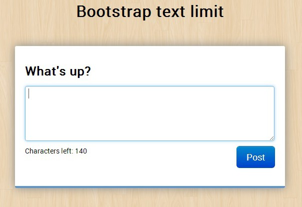

## textbox

A caixa de texto, de longe, é o controle mais utilizado.

Ela serve como entrada básica de texto ou números, na verdade de qualquer caracter.

```html
<input type="text" name="user-name"/>
```

Abaixo, um exemplo hipotético.


## textarea

Sabe aquelas textbox grandonas? São as textbox de várias linhas ou __textbox multiline__.

Em HTML usamos a tag `textarea` para criar o controle.

```html
<textarea>
...
</textarea>
```



As propriedades `rows` e `cols` referem-se ao número de linhas e colunas respectivamente.


## password

Os campos de senha são semelhantes as textboxs], a diferença é que os __dados aparecem escondidos__ pelo sinal de
asterisco (*).

```html
<input type="password" name="old-pass" />
```

Veja na imagem abaixo o uso de 3 campos de senha.


Os campos de senha podem ser estilizados como as textboxes.
