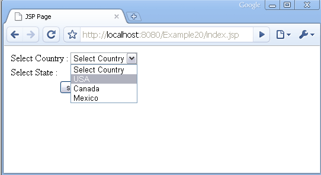

A caixa de seleção (vulgo __combobox__) é um controle parecido com um "menu de opções", veja a imagem abaixo.



A tag para este controle é a `select`.

```html
<select>
...
</select>
```

As opções (que vão dentro da tag `select`) utilizam a tag `option`:

```html
<option>Usa</option>
```

Dessa forma, "options" mais "select", temos __o controle combobox__:

```html
<select id=cbPais>
    <option>Select Country</option>
    <option>Usa</option>
    <option>Canada</option>
    <option>Mexico</option>
</select>
```


## Como funcionam as comboboxes ?

Se, por exemplo, o usuário clicar na opção "Canada" será enviado para o servidor o __par/valor__ `cbPais=Canada`.
Quando não definimos a propriedade `value` o valor passa a ser o texto contido entre as tags options.

```html
<select id=cbPais>
    <option>Select Country</option>
    <option>Usa</option>
    <option>Canada</option>
    <option>Mexico</option>
</select>
```

De forma mais comum, utilizamos a propriedade `value` em cada tag `option`, veja:

```html
<select id=cbPais>
    <option value="" >Select Country</option>
    <option value="usa" >Usa</option>
    <option value="ca" >Canada</option>
    <option value="me" >Mexico</option>
</select>
```

Dessa forma, quando o usuário clicar novamente na opção "Canada" será enviado o __par/valor__ `cboPais=ca`.

Repare que em nosso exemplo a __primeira opção__ era "Select Country", isso ajuda a experiência do usuário, pois ele
verá um instrução na combo e saberá que deve selecionar alguma coisa, veja a combo abaixo:


Ainda pensando na experiência do usuário, também poderíamos colocar o primeiro valor "em branco", exemplo:

```html
<select id=cbPais>
    <option value="" ></option>
    <option value="usa" >Usa</option>
    <option value="ca" >Canada</option>
    <option value="me" >Mexico</option>
</select>
```

O usuário vendo que o controle está em branco (não selecionado) intuirá que precisa selecionar alguma coisa.


Para selecionarmos uma opção utilizamos a propriedade `selected="selected"` na tag `option` que desejamos que seja selecionada.

```html
<select id=cbPais>
    <option value="" ></option>
    <option value="usa" >Usa</option>
    <option value="ca" selected="selected" >Canada</option>
    <option value="me" >Mexico</option>
</select>
```


## Estilizando


O exemplo abaixo mostra dois elementos __select__, o primeiro recebeu altura e largura. O Segundo, além de altura e
borda, alteramos a cor de fundo e retiramos as bordas.

No Firefox, as setas duplas foram substituídas por um única seta após a inclusão da propriedade `border: 0;`. No Google
Chrome, não há setas duplas. Essas pequenas discrepâncias podem ser somadas ao que chamamos de [Cross Browser]().

<a href="exemplo-1.html" class="btn btn-primary">Veja nosso exemplo</a>

O legal desse exemplo é que utilizamos duas classes CSS e, dessa forma, poderemos fazer a combinação que quizermos.

```css
select.basic {

}
select.simple {

}
```

O elemento __select__ poderá sofrer estilização de uma das classes: `<select class="basic">` ou `<select class="simple">`.
Ou ainda utilizar as classes em combinação:

```html
<select class="simple basic">
```


## Listbox - combobox de multipla escolha

As __list box__ são as combobox de multipla escolha, para isso adicionamos a propriedade
`multiple`.

```html
<select multiple>
    <option>Arts</option>
    <option>Politics</option>
    <option>Science</option>
    <option>Computers and internet</option>
</select>
```

Tudo que foi dito para a combobox é válido para a __listbox__, na verdade é o mesmo controle,
só mudamos uma propriedade.


Se você quiser separar o conteúdo por grupo, poderá utilizar a tag `optgroup` como o exemplo abaixo.

```html
<optgroup label="Option group 1">
    <option>Sub option 1</option>
    <option>Sub option 2</option>
    <option>Sub option 3</option>
</optgroup>
```

<a href="exemplo-2.html" class="btn btn-primary">Veja nosso exemplo</a>

