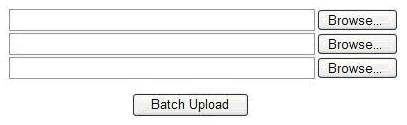

O "input file" é um controle feito para realizar uploads de arquivos.

Ele vem acompanhado de uma text box.

Ao clicar no botão "Browse", o navegador abre a janela "arquivos" de seu sistema operacional e você poderá selecionar os arquivos de seu hard-disk.

```html
<input type="file" />
```

A imagem abaixo ilustra a utilização de 3 input files.


