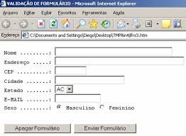

### Os velhos e bons botões

O botão abaixo precisaria de um código [JavaScript](/javascript/) para realizar a submissão da página.

```html
<input type="button" value="Enviar formulário" />
```

O botão submit "já vem pré programado" para realizar o __submit__, ou seja, não precisaremos "codar" em [JavaScript](/javascript/).

```html
<input type="submit" value="Enviar formulário" />
```

O botão reset já não se usa mais, ele limpa as entradas do campos e, como o __botão submit__, ele já vem pré programado.

```html
<input type="reset" value="Apagar formulário" />
```

Visualmente eles são muito parecidos, mas "por de baixo do pano" são bem diferentes.

Repare que a propriedade `value` de ambos os botões servem como uma estampa (label).




### Os novos botões

A tag `<button>` é o que temos de mais atual quando falamos de botões HTML. Ela é mais fácil de estilizar, pois dentro
dela podemos inserir tags como por exemplo `<em>`, `<strong>` ou ``.

```html
<button name="button">Enviar formulário</button>
```

Da mesma forma que o elemento __input__, o atributo `type` também se faz presente, podendo conter um dos valores abaixo:

- submit
- reset
- button (padrão)

Leia mais sobre o elemento na documentação da 
[MDN - button](https://developer.mozilla.org/pt-BR/docs/Web/HTML/Element/button "link-externo").


Estilizando
---

O desafio de estilizar botões é manter um "set" de classes que possam ser utilizados em conjunto. Tomemos como exemplo
as classes do framework [Bootstrap](http://getbootstrap.com/ "link-externo"):

```html
<button class="btn btn-info">Enviar formulário</button>
```

A CSS para o HTML acima poderia ser...

```css

.btn {
    /** Estilização comum a todos o botões */
}
.btn-info {
    /** Estilização específica para os botões do tipo "info" */
}
```

Outro ponto interessante no caso do botões são os estados __hover__ (sobre), __focus__(focado) e __active__(ativo).
Podemos definir estilização para cada um dos estados com a auda das pseudoclasses que recebem o mesmo nome:

```css
.btn-info:hover, .btn-info:focus, .btn-info:acitive {
    /** Estilização para todos os 3 estados do botão info*/
}
```

O exemplo abaixo aviso é bastante simplista, porém dá um a idéia geral de como seu código CSS pode ser inteligente.

<div data-height="178" data-theme-id="2897" data-slug-hash="emJawG" data-default-tab="null" data-user="flaviomicheletti" class='codepen'><pre><code></code></pre>
<p>See the Pen <a href='http://codepen.io/flaviomicheletti/pen/emJawG/'>Simple buttons</a> by Flávio Micheletti (<a href='http://codepen.io/flaviomicheletti'>@flaviomicheletti</a>) on <a href='http://codepen.io'>CodePen</a>.</p>
</div><script async src="//assets.codepen.io/assets/embed/ei.js"></script>