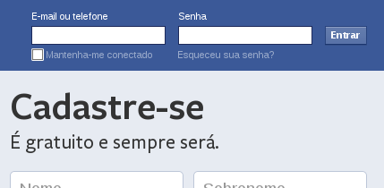

Um __formulário web__ é a porta de entrada dos dados de sua aplicação.

É nele que seu usuário faz a entrada de dados.

Abaixo, temos um exemplo de formulário.

```html
<!DOCTYPE html PUBLIC "-//W3C//DTD XHTML 1.0 Strict//EN"
  "http://www.w3.org/TR/xhtml1/DTD/xhtml1-strict.dtd">
<html xmlns="http://www.w3.org/1999/xhtml" xml:lang="pt" >
    <head>
        <title> Nosso singelo formulário </title>
    </head>
    <body>
        <form action="script-para-onde-envio-os-dados.php" method="post">
            <p>
                Name:  <input type="text" name="username" value="João da Silva" />
            </p>
            <p>
                Email: <input type="text" name="email"  value="joao@dasilva.com" />
            </p>
            <p>
                <input type="submit" value="Submit me!" />
            </p>
        </form>
    </body>
</html>
```


Como os formulários web funcionam?
---

O formulário "pega" os dados digitado pelo usuário, associa cada dado a um nome de campo e os envia ao servidor. 
Lá no outro lado (no servidor), um linguagem de servidor recebe os dados e faz alguma coisa com eles, seguindo a lógica
do script criado pelo programador.

A tag `form` é o início do formulário.

```html
<form>

</form>
```

Dentro das tags `form` colocamos os controles (inputs), labels e alguns botões.

Um formulário na web normalmente é chato de se preencher, só que ele é a alma dos aplicativos web, pois é através de seus
campos que o usuário faz a inserção dos dados e, dessa forma, interage com o sistema.

Um formulário pode (e deve) conter elementos que formam um par `nome=valor`.

Por exemplo, um __campo de entrada de texto__ (uma text box) chama-se `pais` e o seu valor é o texto `Brasil`. Quando
esse formulário submeter seus dados para o servidor, ele poderá trabalhar com a variável `pais` e seu valor será `Brasil`.

Esse negócio é tão simples que fica até difícil de explicar, rs.

Veja o famoso formulário horizontal do Facebook. Vamos analisar apenas a "tarja azul", temos os campos `login`, `senha` 
e uma chekbox "mantanha-me conectado".



Quando o usuário preencher os dados e clicar no botão "Entrar" o servidor poderá trabalhar com os seguintes dados:

    login=email@digitado
    senha=1234
    manter=false

Essa questão da interação __formulário/servidor__  é assunto para as linguagens de servidores. Aqui, no curso de HTML e
CSS vamos nos deter apenas em seu layout e estrutura.

<hr>
Fonte:

- [My first HTML form (MDN) - Exemplo básico de formulário web](https://developer.mozilla.org/en-US/docs/Web/Guide/HTML/Forms/My_first_HTML_form "link-externo")


Estilizando
---

Abaixo temos um formulário bastante simples. O exemplo foi retirado do livro __Cosntruidno Páginas Web com CSS
(Andy Budd)__.

Antes de olhar para o CSS, veja a estrutura do HTML.

<div data-height="395" data-theme-id="2897" data-slug-hash="EaPXKd" data-default-tab="null" data-user="flaviomicheletti" class='codepen'><pre><code></code></pre>
<p>See the Pen <a href='http://codepen.io/flaviomicheletti/pen/EaPXKd/'>formulário-web 1</a> by Flávio Micheletti (<a href='http://codepen.io/flaviomicheletti'>@flaviomicheletti</a>) on <a href='http://codepen.io'>CodePen</a>.</p>
</div><script async src="//assets.codepen.io/assets/embed/ei.js"></script>

A Primeira coisa a ser comentado é que cada controle está acompanhado do elemento `label`. Esse elemento pode ajudar a
adicionar estrutura e aumentar a acessibilidade aos formulários web. Em muitos navegadores, clicar no elemento label 
fará com que o elemento do formulário ganhe o foco, veja o exemplo:

```html
<p>
  <label for="author">Name: </label>
  <input name="author" id="author" type="text" />
</p>
```

Posicionar os __labels__ de modo que eles apareçam verticalmente acima dos elementos do formulário é realmente muito simples.
__Labels__ são [elementos inline](html-css/elementos-inline-block-level/) por padrão. Entretanto, configurar sua propriedade
 `display` como `block` fará com que eles gerem sua própria caixa de bloco, forçando os elementos "de entrada" (inputs)
para a linha de baixo. A largura das caixas de entrada de texto varia entre diferentes navegadores, portanto, para
consistência, você deve configurar explicitamente a largura das suas caixas de texto. Nesse exemplo, __pixels__ são usados,
mas, naturalmente, você poderia utilizar __ems__ para criar um layout de formulário mais auto-ajustável.

```css
label {
    display: block;
}
input {
    width: 300px;
}
```

 


### Outro exemplo

Alterando a regra de estilização das __labels__ como abaixo...

```css
label {
  float: left;
  width: 10em;
}
```

...teremos um arranjo diferente, veja:

<div data-height="346" data-theme-id="2897" data-slug-hash="MYKoeQ" data-default-tab="null" data-user="flaviomicheletti" class='codepen'><pre><code></code></pre>
<p>See the Pen <a href='http://codepen.io/flaviomicheletti/pen/MYKoeQ/'>formulário-web 2</a> by Flávio Micheletti (<a href='http://codepen.io/flaviomicheletti'>@flaviomicheletti</a>) on <a href='http://codepen.io'>CodePen</a>.</p>
</div><script async src="//assets.codepen.io/assets/embed/ei.js"></script>

Essa é a diferença mais significante entre este e o exemplo anterior, porém eu acrescentei estilização extra para posicionar o botão
à direita:

```css
p.botoes {
  text-align: right;
}
#btnSubmit {
  width: 100px;
}
```