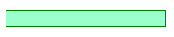
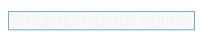
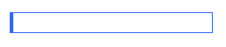
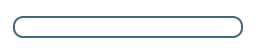

A caixa de texto, de longe, é o controle mais utilizado.

Ele serve como entrada básica de texto ou números, na verdade de qualquer caracter.

```html
<input type="text" name="user-name"/>
```

Abaixo, um exemplo hipotético.


Estilizando
---

Abaixo temos alguns exemplos de estilização da textbox.


### Estilização simples:



```css
input[type="text"] {
    background-color : #99FFCC;
    border: 1px solid #008000;
    width: 230px;
}
```


### Com borda pontilhada:


```css
input[type="text"] {
    border: 2px dashed #D1C7AC;
    width: 230px;
}
```


### Imagem de background:

Este exemplo usa esta [imagem](textbox-background.png) como background.



```css
input[type="text"] {
    background-image: url('textbox-background.png');
    border: 1px solid #6297BC;
    width: 230px;
}
```


### Borda maior:



```css
input[type="text"] {
    width: 230px;
    border: 1px solid #3366FF;
    border-left: 4px solid #3366FF;
}
```


### Bordas arredondadas:



```css
input[type="text"] {
    border: 2px solid #456879;
    border-radius: 10px;
    height: 22px;
    width: 230px;
}
```


### Borda dupla:


```css
input[type="text"] {
    border: 3px double #CCCCCC;
    width: 230px;
}
```


### Gradiente 1:

Este exemplo usa esta [imagem](textbox-gradient.jpg) como background.


```css
input[type="text"] {
    background-image:url('textbox-gradient.png');
    background-repeat:repeat-x;
    border:1px solid #d1c7ac;
    width: 230px;
    padding:3px;
    color:#959595;
}
```


### Gradiente 2:

Este exemplo aproveita a mesma [imagem](textbox-gradient.png) do exemplo "Imagem de background".


```css
input[type="text"] {
    width: 232px;
    background: transparent url(''textbox-background.png'') no-repeat;
    color : #747862;
    height:27px;
    border:0;
    padding:4px 8px;
}
```


### Imagem dentro da textbox:

Este exemplo usa uma [imagem](textbox-search.png) como background.


```css
input[type="text"] {
    background:#FFFFFF url(textbox-search.png) no-repeat 4px 4px;
    padding:4px 4px 4px 22px;
    border:1px solid #CCCCCC;
    width:230px;
    height:25px;
}
```


- - -
Fontes:

- [www.cssportal.com/form-elements/text-box](http://www.cssportal.com/form-elements/text-box.php "link-externo")
