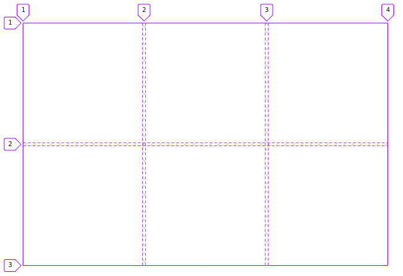
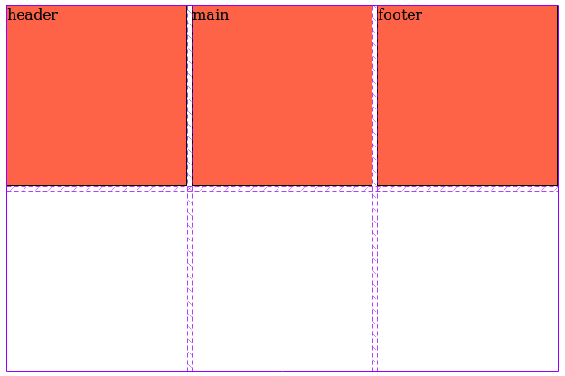
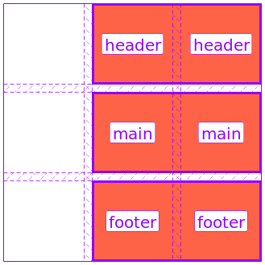
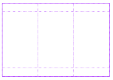

Escrever introdução...


## O que eu espero que você faça

Você deve abrir o navegador e acionar a tecla F12 (abrir a ferramenta de desenvolvedor).

1. Abra o [exemplo-01](exemplo-01.html).
2. Clique na aba "Inspector", depois na aba "Layout" e procure por "Overlay Grid".

Estou utilizando o FireFox eu não encontrei um plugin no Chrome equivalente ao __Grid Inspector__, mas se você procurar
com calma deve encontrar um, ok?


## Primeiro exemplo


O primeiro exemplo é o menor passo que eu pude imaginar, uma div que será nosso container

<a href="exemplo-01.html" class="btn btn-primary">Abra o exemplo-01</a>

```html
<div class="container-box">
    <main class="box"></main>
</div>
```

```css
.container-box {
    width: 200px;
    height: 200px;
    display: grid;
}
```


## Segundo exemplo


```html
<div class="container-box">
    <header class="box"></header>
    <main class="box"></main>
    <footer class="box"></footer>
</div>
```

```css
.container-box {
    width: 200px;
    height: 200px;
    display: grid;
}
```

<a href="exemplo-02.html" class="btn btn-primary">Abra o exemplo-02</a>


## Terceiro exemplo



```html
<div class="container-box">
    <header class="box"></header>
    <main class="box"></main>
    <footer class="box"></footer>
</div>
```

```css
.container-box {
    width: 100%;
     /*height: 400px;*/
    display: grid;
    grid-template-columns: 200px 200px 200px;
    grid-template-rows: 200px 200px;
    grid-gap: 5px;
}
```

<a href="exemplo-03.html" class="btn btn-primary">Abra o exemplo-03</a>


## Quarto exemplo



```html
<div class="container-box">
    <header class="box">header</header>
    <main class="box">main</main>
    <footer class="box">footer</footer>
</div>
```

```css
.container-box {
    width: 100%;
    display: grid;
    grid-template-columns: 200px 200px 200px;
    grid-template-rows: 200px 200px;
    grid-gap: 5px;
}
.box {
    border: 1px solid #000;
    background-color: tomato;
}
```

<a href="exemplo-04.html" class="btn btn-primary">Abra o exemplo-04</a>


## Quinto exemplo




```html
<div class="container-box">
    <header class="box"></header>
    <main class="box"></main>
    <footer class="box"></footer>
</div>
```

```css
.container-box {
    width: 100%;
    display: grid;
    grid-template-columns: 100px 100px 100px;
    grid-template-rows: 100px 100px 100px;
    grid-gap: 10px;
    grid-template-areas:
        " . header header"
        " . main   main"
        " . footer footer";
}
.box {
    border: 1px solid #000;
    background-color: tomato;
}
header {
    grid-area: header;
}
main {
    grid-area: main;
}
footer {
    grid-area: footer;
}
```

<a href="exemplo-05.html" class="btn btn-primary">Abra o exemplo-05</a>


## Sexto exemplo


```html
<div class="container-box">
    <header class="box"></header>
    <main class="box"></main>
    <footer class="box"></footer>
</div>
```

```css
.container-box {
    width: 100%;
    display: grid;
    grid-template-columns: 100px 100px 100px;
    grid-template-rows: 100px 100px 100px;
    grid-gap: 10px;
    grid-template-areas:
        "  .   header header"
        "aside main   main"
        "aside footer footer";
}
.box {
    border: 1px solid #000;
    background-color: tomato;
}
header {
    grid-area: header;
}
aside {
    grid-area: aside;
}
main {
    grid-area: main;
}
footer {
    grid-area: footer;
}
```

<a href="exemplo-06.html" class="btn btn-primary">Abra o exemplo-06</a>


## Sétimo exemplo




```html
<div class="container-box">
    <header class="box"></header>
    <aside class="box"></aside>
    <main class="box"></main>
    <footer class="box"></footer>
</div>
```

```css
.container-box {
    width: 100%;
    max-width: 700px;
    margin: 0 auto;
    display: grid;
    grid-gap: 10px;
    grid-template-columns: auto;
    grid-template-rows: 50px 330px 50px;
    grid-template-areas:
        'header header header'
        'aside main main'
        'footer footer footer'
        ;
}
.box {
    background-color: tomato;
}
header {
    grid-area: header;
}
aside {
    grid-area: aside;
}
main {
    grid-area: main;
}
footer {
    grid-area: footer;
}
```

<a href="exemplo-07.html" class="btn btn-primary">Abra o exemplo-07</a>
