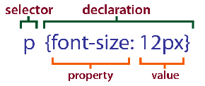

Para estilizar o HTML devemos utilizar a CSS.

CSS - Cascading Style Sheet (Folha de Estilo em Cascata) determina a estilização do conteúdo.

Folha de estilo é um mecanismo simples para adicionar estilos aos documentos web, por exemplo: fontes, 
conteúdos, espaçamentos, etc...

A CSS é uma realidade incontestável para quem desenvolve aplicações web. Não dá para caminhar sem ela, na verdade não dá
nem para sair do lugar. Quero dizer que é preciso aprender CSS para poder desenvolver bem, ou você domina ela ou ela te domina.
Não precisa ser ninja em CSS, mas quanto mais conhecimento você acomular sobre CSS (e HTML também) melhor e mais produtivo
será seu dia a dia como desenvolvedor.

Para o leitor ter uma idéia do poder da CSS dê uma olha no trabalho da [www.csszengarden.com](http://www.csszengarden.com/ "link-externo")

Nesta altura, a __separação das obrigações__ de cada tecnologia deve estar bem claro em sua mente:

- O HTML define a estrutura do documento e
- O CSS define a estilização

Apesar de a sintaxe CSS ser mutio simples, uma única folha de estilos pode conter teoricamente infinita informações de
apresentações. Essa informação é organizada em uma sequência de __instruções__, cada uma esécificando uma __regra__ (
por vezes chamado de conjunto de regras ou __ruleset__). Uma regra típica contém um bloco de declaração, que contém dentro
de si uma série de __declarações__ (compostas de pares `propriedade: valor` e um __seletor__.

A CSS é composta pelo que se chama de "regras de estilização"(rule-sets), um exemplo de regra seria: 

A regra CSS pode conter várias declarações separadas por ponto e vírgula, como no exemplo abaixo:


/* CSS também possuem comentários e você deve utilizá-los */
p {
    font-size: 12px;
    color: green;
}


A letra `p` é o __seletor__, é o alvo da regra CSS.

Entre as chaves `{}`, neste exemplo, há duas propriedades: `font-size` e `color` sendo `12px` e `green` seus respectivos valores.

Há 3 formas de unir o CSS ao HTML: inline, embed e linked.

As versões da CSS
---

CSS é um padrão relativamente antigo. CSS 1 foi adotado em dezembro de 1996 e define propriedades para especificar cores,
fontes, margens, bordas e outros estilos básicos. A segunda edição do padrão, CSS 2, foi adotada em maio de 1998. Ela
define vários recursos mais avançados, mais notadamente o suporte para posicionamento absoluto de elementos. CSS 2.1
esclarece e corrige CSS 2, eliminando recursos que os fornecedores de navegador nunca implementaram. Os navegadores atuais
têm suporte basicamente completo a CSS2,1, embora as versões do IE anteriores ao IE8 tenham omissões notáveis. 

O trabalho em CSS continua. Para a versão 3, a especificação CSS foi dividida em vários módulos especializados que estão
passando pelo processo de padronização separadamente. A especificadamente CSS e os documentos de trabalho podem ser
encontrados no endereço abaixo.

[www.w3.org/Style/CSS/](http://www.w3.org/Style/CSS/ "link-externo")

Veja a próxima matéria
---

- [Unindo o CSS ao HTML](/html-css/unindo-css-html/)