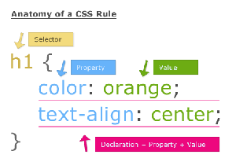
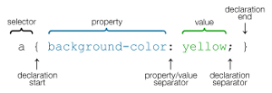
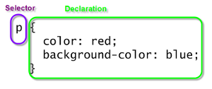

CSS (Cascading Style Sheet) determina a estilização do contéudo.

> Folha de estilo em cascata é um mecanismo simples para adicionar estilos ( por exemplo: fontes, conteudos, espaçamentos)
> aos documentos web.
>
> Fonte: [W3C](http://www.w3.org/Style/CSS/ "link-externo")

Com a CSS é possível estilizar páginas HTML e assim, separar as obrigações de cada tecnologia:

- O HTML define a estrutura do documento e
- O CSS define a estilização

A CSS é composta pelo que se chama de "regras de estilização"(rule-sets), um exemplo de regra seria: 

    todo parágrafo deve ter
        o tamanho da fonte em 12 e
        sua cor deve ser um tom de cinza meio escuro

O tamanho da fonte precisa de uma unidade de medida. As três unidades mais utilizadas são:

- px pixel
- em relativo ao tamanho da fonte
- % porcentage

Agora vamos acertar nosso exemplo.

    todo parágrafo deve ter
        o tamanho da fonte em 12px
        sua cor deve ser um tom de cinza meio escuro

As cores podem ser representadas por números hexadecimais ou no esquema RGB. Por exemplo, o hexadecimal `767676` precedido
do sinal `#`(sharp) é equivalente a "um tom de cinza meio escuro".

    todo parágrafo deve ter
        o tamanho da fonte em 12px
        sua cor deve ser #767676

Abreviando um pouco a regra acima:

    todo parágrafo
        tamanho da fonte: 12px
        cor: #767676

Agora é só traduzir para CSS, veja:


p {
    font-size: 12px;
    color: #767676;
}


A letra `p` é o __seletor__, é o alvo da regra CSS.

Entre as chaves `{}`, neste exemplo, há duas propriedades: `font-size` e `color`. `12px` e `#767676` são seus respectivos valores.

A regra CSS pode conter várias declarações separadas por ponto e vírgula.

Se uma imagem vale por mil palavras, vou lhe mandar 4 imagens, espero que valham 4 mil palavras...

A CSS é uma realidade incontestável para quem desenvolve aplicações web. Não dá para caminhar sem ela, na verdade não dá
nem para sair do lugar. Quero dizer que é preciso aprender CSS para poder desenvolver bem, ou você domina ela ou ela te domina.
Não precisa ser ninja em CSS, mas quanto mais conhecimento você acomular sobre CSS (e HTML também) melhor e mais produtivo
será seu dia a dia como desenvolvedor.

Para o leitor ter uma idéia do poder da CSS dê uma olha nos seguintes trabalhos:

[http://www.csszengarden.com/](http://www.csszengarden.com/ "link-externo")

[http://meyerweb.com/eric/css/edge/](http://meyerweb.com/eric/css/edge/ "link-externo")
