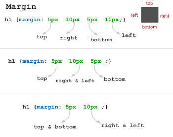

A propriedade CSS __marigin__ define a margem do elemento.

Exemplos...

    /* top | right | bottom | left */
    margin: 5px 10px 5px 10px;

    /* top | horizontal | bottom */
    margin: 5px 10px 5px;

    /* vertical | horizontal */
    margin: 5px 10px;

A imagem abaixo explica melhor.

Se definirmos uma única unidad,e ela valerá para os quatro lados:

    /* Aplicado aos quatro lados */
    margin: 1em;
