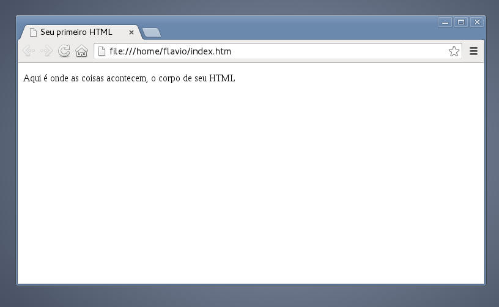

Para criar um HTML você deve abrir um editor de texto simples e inserir o seguinte conteúdo:

```html
<!DOCTYPE html>
<html lang="pt-br">
    <head>
        <title>Seu primeiro HTML</title>
        <meta charset="utf-8">
    </head>
    <body>
        <p>Aqui é onde as coisas acontecem, o corpo de seu HTML</p>
    </body>
</html>
```

Salve o arquivo com a extensão `.html` ou `.htm` e abra o arquivo com seu navegador web preferido (espero que não seja
o IE), o resultado deve ser parecido com o abaixo:




### Explicando o código

<!DOCTYPE html>
<html lang="pt-br">
    <head>
        <title>Seu primeiro HTML</title>
        <meta charset="utf-8">
    </head>
    <body>
        <p>Aqui é onde as coisas acontecem, o corpo de seu HTML</p>
    </body>
</html>


Na linha 1 temos o [DTD (Document type definition)](/html-css/dtd-doctype/), ele define qual é o tipo de documento, no exemplo ele indica que
o documento é do tipo [HTML5](/html-css/html5/). Inclua sempre o DTD, vulgo __doctype__ em seus arquivos HTML, em breve
voltaremos a falar mais sobre esse assunto. Por hora, saiba que ele é muito importante.

Na linha 2 começamos o HTML de fato. Entre as linhas 3 e 6 temos o __cabeçalho__ (head) e entre as linhas 7 e 9 temos
o __corpo__ (body) do HTML.

Me lembrei do Joel Santana na propaganda do Head & Shoulders, aqui é Head & Body:


O conteúdo que vai dentro da tag body é reenderizado pelo browser, é o conteúdo de seu site/sistema.

Na linha 5 temos o misterioso `meta charset="utf-8"`, ele define qual o __conjunto de caracteres__ sua página está usando,
este é outro assunto que trataremos em breve.


<hr>
Fonte: 
- [Introdução ao HTML- Mozilla.](https://developer.mozilla.org/pt-BR/docs/HTML/Introduction "link-externo")


Veja a próxima matéria
---

- [Criando um HTML de primeira qualidade](/html-css/html-primeira-qualidade/)