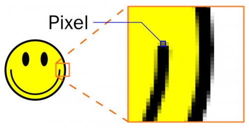

Neste artigo veremos uma breve introdução aos principais elementos utilizados para construir uma página HTML.

Indico este artigo para quem está iniciando e ainda não não entende bem qual é a o papel (ou função) de cada elemento.

Se você não entende nada de HTML, então eu aconselho a dar uma olha nos [primeiros capítulos](../) deste compêndio.


## Estrutura Básica

O elemento `<head>` contém informações sobre a sua página.

O que estiver dentro do elemento `<body>` é o que será exibido no navegador.

```html
<html>
    <head>
        <title>This is the Title of the Page</title>
    </head>
    <body>
        <h1>This is the Body of the Page</h1>
        <p>Anything within the body of a web page is
        displayed in the main browser window.</p>
    </body>
</html>
```

Mas não se engane! A estrutura acima não é suficiente, ele é reconhecida como sendo HTML 4.

Para completar a estrutura precisaremos indicar corretamente o __DocType__.


## DocType

O DocType tem a função de indicar ao navegador qual tipo de página ele irá renderizar.

Antigamente tínhamos um palavrão de DocType:

```html
<!DOCTYPE HTML PUBLIC "-//W3C//DTD HTML 4.01//EN" "http://www.w3.org/TR/html4/strict.dtd">
```

E não era um não, eram vários:

- HTML 4.01 Strict
- HTML 4.01 Transitional
- HTML 4.01 Frameset
- XHTML 1.0 Strict
- XHTML 1.0 Transitional
- XHTML 1.0 Frameset
- XHTML 1.1

Com o HTML 5 o doctype foi simplificado, bem simplificado...

```html
<!DOCTYPE html>
```


## Estrutura Mínima

Agora sim temos um estrutura minima que compõem um HTML 5.

Temos o Docype, temos o atributo `lang="pt-br"` e temos também a tag `meta` com o atributo `charset="utf-8"` que
define a codificação de caracteres de uma página.

```html
<!DOCTYPE html>
<html lang="pt-br">
    <head>
        <title>Seu primeiro HTML</title>
        <meta charset="utf-8">
    </head>
    <body>
        <p>Aqui é onde as coisas acontecem, o corpo de seu HTML</p>
    </body>
</html>
```


## Texto

O texto é o principal de seu site, é o conteúdo.

Os parágrafos devem utilizar a tag `<p>`.

```html
<p>
    A paragraph consists of one or more sentences
    that form a self-contained unit of discourse. The
    start of a paragraph is indicated by a new
    line.
</p>
<p>
    Text is easier to understand when it is split up
    into units of text. For example, a book may have
    chapters. Chapters can have subheadings. Under
    each heading there will be one or more
    paragraphs.
</p>
```

Para títulos temos as tags `h1` a `h6`, portanto, 6 níveis de subtítulos.

```html
<h1>
<h2>
<h3>
<h4>
<h5>
<h6>
```

Uma página deve ter títulos e subtítulos bem definidos, os mencanismos de buscas consideram esse fator importante.

Uma página deve ter pelo menos uma tag `h1` (princípio de SEO).

Aprenda mais sobre [elementos de texto](../texto/).


## Links

Os links são as "pontes da Internet, eles ligam uma página a outra.


O código abaixo...

```html
<a href="path/to/pagina.html">Your link</a>
```

..gerará o seguinte resultado:

<a href="path/to/pagina.html">Your link</a>

O atributo `href` aponta para a próxima página.

Aprenda mais sobre [âcoras e links](../ancoras-links/).


## Listas

Num primeiro olhar, as listas parecem que foram feitas para organizar as coisas, isso está certo. Mas a principal
função das listas é ajudar a criar menus (veremos isso em breve).

Temos as listas ordenadas (ordered lists):

__código:__

```html
<ol>
    <li>Chop potatoes into quarters</li>
    <li>Simmer in salted water for 15-20 minutes until tender</li>
    <li>Heat milk, butter and nutmeg</li>
    <li>Drain potatoes and mash</li>
    <li>Mix in the milk mixture</li>
</ol>
```
__resultado:__

<ol>
    <li>Chop potatoes into quarters</li>
    <li>Simmer in salted water for 15-20 minutes until tender</li>
    <li>Heat milk, butter and nutmeg</li>
    <li>Drain potatoes and mash</li>
    <li>Mix in the milk mixture</li>
</ol>

Temos as listas sem ordenação (unordered lists):

__código:__

```html
<ul>
    <li>1kg King Edward potatoes</li>
    <li>100ml milk</li>
    <li>50g salted butter</li>
    <li>Freshly grated nutmeg</li>
    <li>Salt and pepper to taste</li>
</ul>
```
__resultado:__

<ul>
    <li>1kg King Edward potatoes</li>
    <li>100ml milk</li>
    <li>50g salted butter</li>
    <li>Freshly grated nutmeg</li>
    <li>Salt and pepper to taste</li>
</ul>

Aprenda mais sobre [listas](../listas/).


## Imagens



Com a tag `img` é possível colocar imagens no HTML.

O atributo `src` deve apontar para sua imagem no seu disco rígido, estou me referindo ao endereço (localização) do arquivo.
Temos o endereço absoluto e o relativo.

A imagem acima é exibida graças ao código HTMl abaixo.

```html

```
O atributo `alt` é uma mensagem alternativa que será exibida caso o endereço não localize o alvo (o arquivo).

![[Aqui jaz uma imagem]](nome-errado.jpg)

Nós vemos a mensagem acima porque eu incluí o HTML abaixo.

```html

```

Obs: Os colchetes não são necessários, eu que incluí por gosto pessoal.


## Tabelas

Uma tabela é composta por __linhas__ e __células__.

As tabelas começam com a tag `<table>`, as linhas da tabela são definidas pela tag `tr` (__table row__). Dentro das
linhas temos as células, elas são definidas pela tag `td`(__table data__).

Vamos ao nosso primeiro exemplo de tabela:

__código:__

```html
<table>
    <tr>
        <td>campo1</td><td>campo2</td><td>campo3</td>
    </tr>
    <tr>
        <td>campo1</td><td>campo2</td><td>campo3</td>
    </tr>
    <tr>
        <td>campo1</td><td>campo2</td><td>campo3</td>
    </tr>
</table>
```

__resultado:__

<table>
    <tr>
        <td>campo1</td><td>campo2</td><td>campo3</td>
    </tr>
    <tr>
        <td>campo1</td><td>campo2</td><td>campo3</td>
    </tr>
    <tr>
        <td>campo1</td><td>campo2</td><td>campo3</td>
    </tr>
</table>

<style>
td {
    border: 1px solid #999;
    padding: 5px;
}
table {
    border-collapse: collapse;
}
</style>

Aprenda mais sobre [tabelas](../tabelas/).


## Formulários

```html
```

```html
```

