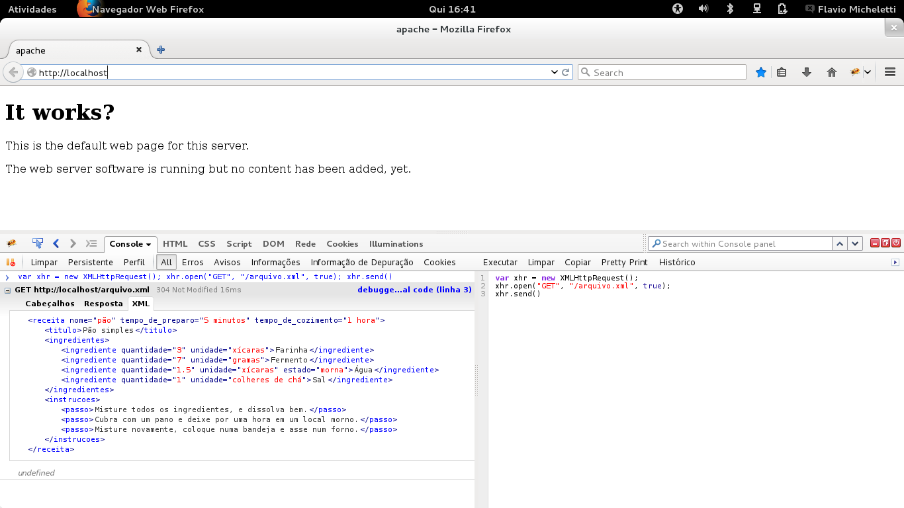

> __Ajax__ é o acrônimo (sem letras maiúsculas) de Asynchronous JavaScript and XML O termo foi inventado por Jesse James
> Garrett e apareceu pela primeira vez em seu ensaio de fevereiro de 2005. "v"
> 
> [http://www.adaptivepath.com/ideas/ajax-new-approach-web-applications/](http://www.adaptivepath.com/ideas/ajax-new-approach-web-applications/ "link-externo")
> 
> "__Ajax__" foi um jargão popular por mutios anos; agora é apenas um termo útil para uma arquitetura de aplicativo Web
> baseada em scripts de requisições HTTP.
> 
> Flanagam em seu livro "JavaSCript O gua Definitivo", capítulo 18 (scripts HTTP)
    

### AJAX em 3 linhas

Não acredita? Ei-lo aqui...


var xhr = new XMLHttpRequest();
xhr.open("GET", "/arquivo.xml", true);
xhr.send()


__Linha 01...__

Uma vez tenhamos criado um objeto __XMLHttpRequest__, devemos chamar dois métodos `open()` e `send()`.

__Linha 02...__

O método `open(verbo-http, local-caminho, assincrono)` recebe dois argumentos obrigatórios. O primeiro argumento é tipo 
(verbo) de pedido __HTTP__ que você deve enviar (GET, POST, DELETE, etc...). O segundo é o local a partir do qual você 
deseja solicitar dados. A URL pode ser relativo ou absoluto, mas devido às preocupações com segurança entre domínios, o 
destino deve residir no mesmo domínio.

O terceiro argumento do método `open()` é um valor booleano que especifica se o pedido é feito de forma __assíncrona__
(true) ou síncrona (false). Um pedido síncrono (sincronizado) congelará o navegador até que tenha terminado. Um pedido
__assíncrono__ (dessincronizado) ocorre em segundo plano no aplicativo, permitindo que outros scripts sejam executados.

__Linha 03...__

Uma vez que `open()` seja usado para inicializar uma conexão, o método `send()` ativará essa conexão e fará o pedido.

    xhr.send(null)

Se o arquivo _XML__ não existir você deverá ver um erro, qual erro vai depender de onde você está executando esse código
__JavaScript__. Eu estou utilizando o __FireBug__ no __Firefox(34)__, veja um print de minha tela.

 

Se o arquivo não existir ou se o endereço estiver errado veremos o erro "404 página não encontrada":

    GET http://localhost/arquivo.xml 404 Not Found

