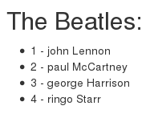

Este artigo é um exemplo de integração da Collections (coleção) e da View (visão) do framework Backbone. Indicado para 
quem já conhece um mínimo do Backbone e/ou leu os artigos anteriores. O objetivo é demonstrar como podem interagir a
collection e a view. Faremos isso criando um lista (`ul`) e inserindo alguns itens.

Nosso HTML inicial será como o abaixo.

```html
<div id="app-container">
    <h2>The Beatles:</h2>
    <ul id="lista-container"></ul>
</div>
```

No JavaScript precisaremos criar uma coleção  e alguns models. Após devemos definir nossa view e no método `render()`
percorrer os elementos da coleção e a cada iteração acrescentar um elemento da lista (`li`).

Se você acompanhou os artigos anteriores sobre o Backbone, então o código abaixo dispensa maiores explicações.

```javascript
//
// Collection
//
var theBeatles = new Backbone.Collection();

//
// Models
//
theBeatles.add([{id: 1, firstName: 'john',   lastName: 'Lennon'}]);
theBeatles.add([{id: 2, firstName: 'paul',   lastName: 'McCartney'}]);
theBeatles.add([{id: 3, firstName: 'george', lastName: 'Harrison'}]);
theBeatles.add([{id: 4, firstName: 'ringo',  lastName: 'Starr'}]);

//
// View
//
var AppView = Backbone.View.extend({
    el: $("#app-container"),
    initialize: function () {
        this.$lista = $('#lista-container');
        this.render();
    },
    render: function() {
        var that = this;
        theBeatles.forEach(function(model, index){
            that.$lista.append('<li>' + model.get('id') +
                               ' - ' + model.get('firstName') +
                               ' ' + model.get('lastName') + '</li>');
        });
    }
});

//
// Instanciando a visão (view)
//
var app_view = new AppView();
```

O resultado deve ser semelhante a imagem abaixo.



Veja a demo no [jsfiddle.net/flaviomicheletti/hcL4jg6v/](http://jsfiddle.net/flaviomicheletti/hcL4jg6v/ "link-externo")
