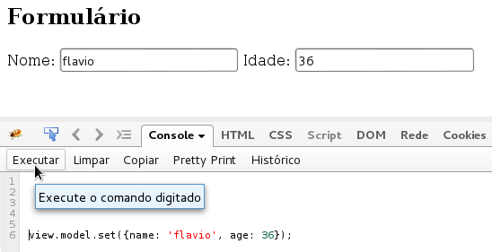
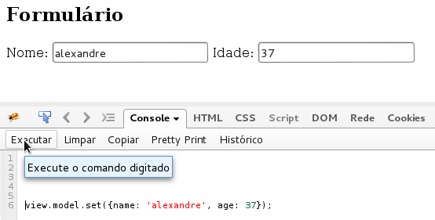
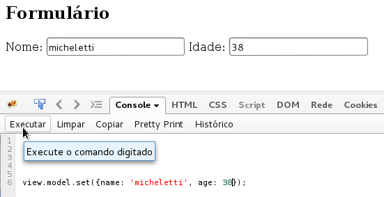

Este artigo é um exemplo de integração do Model (modelo) e da View (visão) do framework Backbone. Indicado para quem já
conhece um mínimo do Backbone e/ou leu os artigos anteriores. O objetivo é demonstrar como funciona o evento `change`
dos modelos e como ele pode interagir com a visão.

Iremos construir um formulário com dois campos de textos: nome (name) e idade (age).

Um [formulário web](/html-css/formularios/) depende da tag `<formulário>`, mas neste exemplo ela não se faz necessário.

Veja nosso HTML:

```html
<div id="app-container">
  <h2>Formulário</h2>
  <label>Nome: <input type="text" id="txtNome" /></label>
  <label>Idade: <input type="text" id="txtAge" /></label>
</div>  
```

No JavaScript, iremos construir um modelo denominado `Person`. Nossa visão trabalhará com o elemento HTML `#app-container`,
inicializará os campos textos e o modelo. A função `render()` será encarregada de atualizar a visão.

Como dito, vamos utilizar o evento `change` do modelo, ele escuta as alterações em cada propriedade. Mas você também
quer escutar a alteração em determinada propriedade, sem interferir nas demais. Para isso, você deve colocar o nome da 
propriedade na frete do evento, exemplo: `change:age`.

```javascript
//
// Definindo um modelo (model)
//
var Person = Backbone.Model.extend({
  defaults: {
    name: '',
    age: 0
  }
});

//
// Definindo uma visão (view)
//
var AppView = Backbone.View.extend({
    // este é o elemento principal
    el: $('#app-container'),
    // executado ao instanciarmos a visão
    initialize: function () {

        // armazenado campos de textos
        this.$txtNome  = this.$el.find('#txtNome');
        this.$txtIdade = this.$el.find('#txtAge');

        // armazenando modelo
        this.model = new Person({});

        // Fazendo o modelo escutar o evento `change`, forma 1:
        //this.listenTo(this.model, 'change', this.render);

        // Fazendo o modelo escutar o evento `change`, forma 2:
        this.model.on('change', this.render, this);
    },
    // lógica de renderização
    render: function () {
        this.$txtNome.val(this.model.get('name'));
        this.$txtIdade.val(this.model.get('age'));
    }
});

//
// Iniciamos a aplicação
//
var view = new AppView();
// Alteramos o modelo
view.model.set({name: 'flavio', age: 36});
```

Repare que para "ligar" o evento `change` do modelo podemos utilizar uma das seguintes funções: 
[listenTo()](http://backbonejs.org/#Events-listenTo "link-externo") ou
[on()](http://backbonejs.org/#Events-on "link-externo"), veja a documentação do Backbone para maiores detalhes.

É exatamente neste ponto que a "mágica" acontece. Dissemos ao programa que a cada alteração no modelo a visão (nosso
famigerado formulário) deve ser atualizada.

Ressalto que o envento `change` escuta todas as propriedades do modelo, que dizer, a alteração em uma ou mais 
propriedade disparará o evento e, consequentemente, renderizará a visão.

### Use o console do navegador

Se você possui uma certa experiência com o console do navegador conseguirá alterar o modelo e ver as alterações conforme
as imagens abaixo.



Segunda alteração:



Mais uma alteração:



Veja a demo no [jsfiddle](http://jsfiddle.net/flaviomicheletti/mwkf7pog/1/ "link-externo")