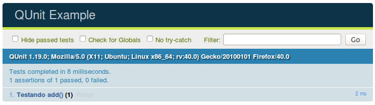

Talvez esse seja o seu primeiro contato com o universo de "testes". Eu estou utilizando o código 
[Code - Somando](/javascript/code-somando/) que é estupidamente simples e, obviamente, o teste também será igualmente 
simples. Meu objetivo é introduzir você ao mundo dos testes (imaginando que você seja iniciante).

Abaixo vemos o código mencioando "Code - Somando":

```javascript
var num = 0;

function add() {
    num++;
    mostrar(num);
}

function sub() {
    num--;
    mostrar(num);
}

function mostrar(valor) {
    document.getElementById("resultado").innerHTML = valor;
}
```

Quando clicamos no botão "somar" (o botão está no HTML) pela primeira vez o que acontece?

O valor `1` é exibido, pois somamos uma unidade ao valor inicial (`0`).

Esse é o seu teste visual, manual, demorado, trabalhoso de se repetir.

Então, como podemos ensinar o computador a fazer este teste por nós?

Podemos comparar o valor esperado com o valor obtido, por exemplo: 

```
var esperado; resultado;

add();

esperado  = 1;
resultado = num; # a variável `num` advem do seu programa.

if (resultado == esperado) {
    console.log('seu teste passou!');
} else {
    console.log('seu teste falhou!');
}
```

Isso é um teste!

Quando escrevemos testes devemos utilizar um framework de testes para que possamos usufruir da estrutura 
[xUnit](https://pt.wikipedia.org/wiki/XUnit "link-externo") que ele fornece.

Neste exemplo vou utilizar o [QUnit](http://qunitjs.com/ "link-externo") como framework de tests.

No caso do QUnit a nossa estrutura de arquivos ficará semelhante a exibida abaixo.

    /pasta-qualquer/
        index.html    // para executar os testes
        index.js      // aplicação
        tests.js      // teste da aplicação

Veja a documentação do QUnit para saber como preparar o framework, vai lá que é fácil.

Os frameworks possuem diversas asserções (leia-se afirmações, declarações, etc...). temos, por exemplo, a que testa a
igualdade (`equal`). É uma função que, normalmente aceita dois parâmetros: o esperado e o resultado. O QUnit possui ainda
o terceiro parâmetro que é uma mensagem exibida caso o teste falhe. Veja como ficaria nosso teste...

```javascript
//
// "Clicamos no botão 'somar'"
//
add();

//
// Checamos o resultado obtido
//
assert.equal(num, 1, "Ao executar `add()` 1 vez, `num` deve ser igual a 1");
```

Nosso código está incompleto, ele precisa estar dentro de uma função chamada `test()` onde o primeiro parâmetro é uma
string descrevendo o que está sendo testado, por exemplo, "Testando função x()" e o segundo parâmetro é uma função de
callback com o código que efetua os testes.


```javascript
QUnit.test( "Testando add()", function( assert ) {
    // "Clicamos no botão 'somar'"
    add();
    // Checamos o resultado obtido
    assert.equal(num, 1, "add() 1 vez, num deve ser igual a 1");
});
```

Se abrirmos o arquivo `index.html` veremos o resultado do teste no navegador.



Agora podemos ampliar nosso teste para termos certeza do funcionamento do código e, inclusive, adicionar o teste da 
função `sub()`.

```javascript
QUnit.test( "Testando add()", function( assert ) {
  num = 0;
  add();
  assert.equal(num, 1, "add() 1 vez, num deve ser igual a 1");

  add();
  assert.equal(num, 2, "add() 2 vezes, num deve ser igual a 2");

  add();
  assert.equal(num, 3, "add() 3 vezes, num deve ser igual a 3");
});

QUnit.test( "Testando sub()", function( assert ) {
  num = 0;
  sub();
  assert.equal(num, -1, "sub() 1 vez, num deve ser igual a -1");

  sub();
  assert.equal(num, -2, "sub() 2 vez, num deve ser igual a -2");
});
```

Observações...

Repare que foi preciso inicializar a variável `num` em cada teste pois ela é uma variável global.

Outra coisa, a função...

```javascript
function mostrar(valor) {
    document.getElementById("resultado").innerHTML = valor;
}
```

...foi alterada conforme exibido abaixo.

```javascript
function mostrar(valor) {
    var element = document.getElementById("resultado");
    if (element) {
        element.innerHTML = valor;
    }
}
```

Isso porque ao executar os testes não temos o elemento HTML e, portanto, o resultado da função `getElementById()` será
`null`.

Chegamos ao fim!

Qualquer dúvida utilize o disqus.