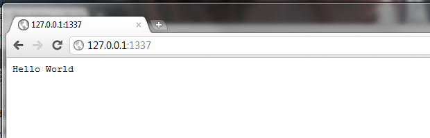

O que é debugar ?

Precisamos debugar o programa para sabermos onde e como está ocorrendo o erro. 

Essa frase faz parte do dia a dia do desenvolvedor e, não raro, ela tira o sono de muita gente.

Debugar é um esforço para encontrar determinado ponto (às vezes vários pontos) "defeituoso" no código para que seja
corrigido.

Debugar é o aportuguesamento da palavra debug. É sinônimo de depurar, acho que esse é o termo mais correto. Mas gramática
não é o tema desta matéria. Nosso objetivo aqui é entender esse processo.

Ao sentar-se na frente do computador para codificar (seja lá o que for) o desenvolvedor estabelece, ou deveria 
estabelecer, uma conversa com o computador e seu código fonte:

    dev: E aí computer, me mostre o VALOR da variável "resultado".

    cpu: Ok, mas parece que não está retornando nada, veja o valor que ela contém... "".

    O dev para e pensa um pouco: Qual será o tipo do dado, pois o valor não está ajudando muito.

    dev: Computer, me mostra agora TIPO de dado da variável "resultado".

    cpu: string(0)

    O dev novamente reflexivo: O valor é "", o tipo é string. Acho que vou "parar" em outro ponto...

Esse é o processo de depuração: ir parando em determinados pontos do código fonte e pedir para o computador mostrar o 
que vai em sua memória.

Acredite, isso não é nada sexy.

Esse "ponto" ao qual estou me referindo nada mais é do que uma linha de código, por isso que 99% dos editores de código
enumeram as linhas do arquivo. Seu colega de trabalho do andar de cima te liga é diz: "veja o erro está na linha 37". 
Você deve olhar a linha 37 com a tranquilidade de que está tratando exatamente a mesma linha.

Em muitos casos, o problema não está exatamente na linha que estamos debugando. O problema é culpa de umas linhas um 
pouco mais acima, ou até de outro script.

Em outros casos, podem aparecer diversos erros, mas que foram ocasionados por uma única linha. A correção dessa linha 
significa a correção de todos os erros descobertos. Veja a tirinha baixo:

[Fonte da imagem](http://vidadeprogramador.com.br/2011/08/19/erro-nao-documentado/ "link-externo")

Superficialmente, debugar é sinônimo de teste, mas em essência são coisas totalmente diferentes. "Testes" é uma palavra
com escopo ampliado, veja o que a [Wikipedia](http://pt.wikipedia.org/wiki/Teste_de_software "link-externo") tem a nos
dizer sobre testes.

Formas rudimentares
---

A forma mais rudimentar de debugar em JS é exibir um alerta, mas com o tempo você vai se encher com essas popup e logo vai 
procurar uma alternativa.

    var minha_variavel = "Hello, word";
    alert(minha_variavel);

Outra forma, também rudimentar, seria mostrar o resultado na própria página (nosso HTML) através do método `write()` do
objeto nativo [document](/javascript/refs/docuement).

    var minha_variavel = "Hello word";
    document.write(minha_variavel);

Depuradores (subindo um degrau)
---

Quem desenvolve em JavaSCript e utiliza o [FireFox](https://www.mozilla.org/pt-BR/firefox/new/ "link-externo") para ver
o resultado pode contar com o [Firebug](https://getfirebug.com/ "link-externo") (já comentei um monte de vez sobre esse
plugin em matérias anteriores). Se você ainda não tem ele instalado, faça isso imediatamente.

O Firebug é um plugin do navegador Firefox, ele é open source e está disponível para download 
[addons.mozilla.org](https://addons.mozilla.org/pt-br/firefox/addon/firebug "link-externo").

    var minha_variavel = "Hello word!";
    console.log(minha_variavel);

A imagem abaixo ilustra o resultado do console do Firebug, repare que o desenvolvedor está usando o plugin na IDE Eclipse.

<del>Em breve, voltarei para apresentar brevemente o Firebug.</del>

Já voltei!

Cada vídeo que eu gravo é uma aventura! No primeiro, havia a voz da minha pequena grande Joana, neste eu estava com 
gripe e minha voz (que já é baixa) ficou super abafada, tentei amplificar mais consegui apenas alguns chiados.

De qualquer forma, vale a pena assistir ao video, é uma breve demonstração do Firebug e das funcionalidades comentadas.

<iframe width="560" height="315" src="http://www.youtube.com/embed/IP8xDTGkfjc" frameborder="0" allowfullscreen></iframe>