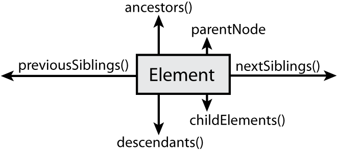
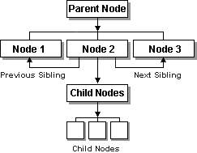

__DOM__ é um acrônimo para Document Object Model (Modelo de Objetos de Documento) ele representa os objetos de uma página
HTML em forma de uma árvore. O __DOM__ é importante pois é através dele que acessamos os elementos dentro de uma página
HTML. Em outra palavras, obtemos acesso ao documento HTML através do __DOM__.

O exemplo abaixo...

```html
<!DOCTYPE html>
<html>
    <head>
        <title>Sample Document</title>
    </head>
    <body>
        <h1>An HTML Docuemnt</h1>
        <p>This is a <i>simple</i> document</p>
    </body>
</html>
```

.. gera a seguinte árvore __DOM__:


Quando um documento HTML é baixado no navegador, esse navegador precisa transformar em uma página Web o que é basicamente
uma longa string de caracteres. Para tanto, o navegador decide quais partes são parágrafos, quais são cabeçalhos, quais
são texto e assim por diante. Para evitar que os pobres programadores de JavaScript tenham de fazer exatamente o mesmo
trabalho, o navegador armazena sua interpretação do código HTML como um estrutura de objetos, chamada
__Document Object Model__ ou __DOM__. Como resultado da maneira pela qual o código HTML é escrito - como uma hierarquia
de elementos aninhados, marcados com tags de início e fim - o __DOM__ cria um objeto diferente para cada elemento, mas
vincula cada objeto de elemento ao seu elemento circundante (ou elemento pai). Isso cria uma relação pai-filho 
(parent-children) explícita entre os elementos e torna mais imediata a visualização do __DOM__ como uma estrutura em árvore.

Abaixo vemos outro exemplo da árvore __DOM__, repare que os nós de texto também foram incluídos.


__Document Object Model__ ou __DOM__, é a API fundamental para representar e manipular o conteúdo de documentos
__HTML__ e __XML__. A API não é especialmente complicada, mas existem vários detalhes de arquitetura  que precisam ser
 entendidos.

Trabalhar com a árvore __DOM__ de uma página é uma das tarefas mais comuns do JavaScript no lado do cliente. Isso também
é uma das principais causas de dores de cabeça ( e dá ao JavaScript uma má reputação), porque os métodos __DOM__ são
implementados de forma inconsistente nos navegadores. É por isso que usar uma [boa biblioteca JavaScript](/javascript/bibliotecas/),
que abstraia as diferenças dos navegadores, pode acelerar significativamente o desenvolvimento. Considere ao menos
aprender 2 ou 3 bibliotecas JavaScript.

O acesso ao __DOM__ é caro; ele é o maior gargalo no que diz respeito a desempenho no JavaScript. É por isso que o __DOM__
costuma ser implementado separadamente do mecanismo JavaScript. Do ponto de vista de um programador, faz sentido usar essa
abordagem, porque uma aplicação JavaScript pode nem precisar do __DOM__. O ponto principal é que é o acesso ao __DOM__
deveria ser reduzido ao mínimo, leia o artigo [Reduzindo o acesso ao DOM](/javascript/dom-reduzindo-acesso-ao-dom/) para obter mais informações.


Métodos diretos para acessar o documento
---

O __DOM__ define várias maneiras de selecionar elemento, você poderá consultar um documento através de uma das abordagens
abaixo:


### Selecionando elementos pela identificação

Qualquer elemento HTML pode ter um atributo `id`. O valor desse atributo deve ser único dentro do documento - dois
elementos no mesmo documento não podem ter a mesma identificação. Você pode selecionar um elemento com base nessa
identificação exclusiva com o método `getElementById()` do objeto __document__.

```javascript
var elemento = document.getElementById("identificacao");
```

Leia mais sobre a função [getElementById()](/javascript/refs/getelementbyid/)


### Selecionando elementos pelo nome

A atributo HTML `name` se destinava originalmente a atribuir nomes a elementos de formulário e o valor desse atributo
é usado quando dados de formulário são enviados para um servidor. Assim como o atributo `id`, `name` atribui um nome
a um elemento. Ao contrário de `id`, contudo, o valor de um atributo `name` não precisa ser único: vários elementos
podem ter o mesmo nome e isso é comum no caso de [botões de seleção](/html-css/formularios/radio-buttons/) e 
[caixa de seleção](/html-css/formularios/combobox/) em formulários web. Além disso ao contrário de `id`, o atributo 
`name` é válido somento em alguns elementos HTML, incluindo 
[formulários](http://www.devfuria.com.br/html-css/formularios/intro-formularios-web/), 
[elementos de formulário](http://www.devfuria.com.br/html-css/formularios/), tag `iframe` e tag 
[img](http://www.devfuria.com.br/html-css/formularios/intro-formularios-web/).


```javascript
var elementos = document.getElementByName("nome-dos-elementos");
```

Leia mais sobre a função [getElementByName()](/javascript/refs/getelementbyname/)


### Selecionando elementos pela tag

Para obter um objeto semelhante a um array somente leitura, contendo os objetos __Element__ de todos os elementos `span`
em um documento, por exemplo, você poderia escrever:

```javascript
var spans = document.getElementsByTagName("span");
```

Leia mais sobre a função [getElementByTagName()](/javascript/refs/getelementsbytagname/)


### Selecionando elementos pela classe CSS

A atributo `class` de uma HTML é uma lista separada de zero ou mais identificadores por espaços. Ele descreve uma maneira
de definir conjuntos de elementos relacionados do documento: todos os elementos que têm o mesmo identificador em seu
atributo `class` fazem parte do mesmo conjunto.

A [HTML 5](/html-css/) define um método `getElementByClassName()` que nos permite selecionar conjuntos de elementos de
documento com base nos identificadores que estão em seu atributo `class`.

```javascript
var elementos = document.getElementByClassName("nome-da-classe");
```

Leia mais sobre a função [getElementByClassName()](/javascript/refs/getelementbyclassname/)


### Selecionando elementos através dos seletores CSS

O padrão da W3C conhecido como [API de Seletores]( "link-externo") define métodos JavaScript para obter os elementos
que coincidem com determinado [seletor CSS](/html-css/seletores-css/). O segredo dessa API é o método `querySelectorAll()`,
ele recebe um argumento de string contendo um seletor CSS e retorna um objeto [NodeList](/javascript/refs/dom-nodelist/) 
representando  todos os elementos do documento que correspondem ao seletor.

Leia mais sobre a função [queryselectorall()](/javascript/refs/queryselectorall/)


Navegando pela árvore DOM
---




Os métodos para encontrar elementos __DOM__ que descrevemos até aqui foram muito direcionados, estamos pulando 
diretamente para um nó específico na árvore, sem nos preocuparmos com as conexões no meio. Após ter selecionado um 
elemento do documento, às vezes você precisa encontrar partes estruturalmente relacionada:

- parent (pais)
- siblings (irmãos)
- childrens (filhos)




### Localizando um pai (parent)

Todo nó de elemento possui um pai, exceto o nó do documento. Consequentemente, cada nó de elemento tem uma propriedade
chamada `parentNode`, uma referência para o pai do elemento distinto.

```javascript
elem.parentNode
```


### Localizando filhos (childrens)

Um elemento só pode ter um pai (parent), mas pode ter muitos filhos (childrens). Você pode encontrar todos os filhos de 
um elemento, usando a propriedade `childNodes`. Ela é, na verdade, uma lista de nós que contém todos os filhos do elemento,
no ordem de origem.

```javascript
elem.childNodes     // lista completa de filhos
elem.childNodes[0]  //
elem.childNodes[1]  // Acessando filhos individualmente
elem.childNodes[2]  //
//etc...
```

Podemos também localizar o primeiro filho:

```javascript
elem.firstChild
```

Ou o último filho:

```javascript
elem.lastChild
```

### Localizando irmãos (siblings)

Assim como podemos navegar para cima e para baixo na árvore __DOM__, também podemos ir de um lado para o outro, obtendo
o próximo nó ou o anterior (ambos no mesmo nível). As propriedades que utilizamos para isso são `nextSibling` e `previousSibling`.

```javascript
var proximoIrmao  = elem.nextSibling
var anteriorIrmao = elem.previousSibling
```


Acessando os atributos
---

Os elementos HTML  consistem em um nome de tag e um conjunto de pares nome/valor conhecidos como atributos. Por exemplo,
o elemento `<a>` que define um hiperlink utiliza o valor de seu atributo `href` como destino do link.

    <a href="www.defuria.com.br" id="um-link-qualquer">link</a>"

Os valores de atributo dos elementos HTML estão disponíveis como propriedades dos objetos HTMLElement que representam 
esses elementos. Dessa forma

```javascript
var link = document.getElementById("um-link-qualquer");
console.log(link.href);
```

O __DOM__ também oferece outras API's para obter e configurar os valores de atributos HTML não pradonizados, mas que
também funcionam com os demais atributos.

```javascript
var link = document.getElementById("um-link-qualquer");
link.setAtributte("href", "http://www.w3.org/")
console.log(link.getAtributte("href"));

```

### Resumo

- `elem.[nome do atributo]` para leitura e escrita
- `elem.getElementById("nome do atributo")` para leitura
- `elem.setAtributte("nome do atributo", "valor do atributo")` para escrita


Manipulando o DOM
---

Podemos criar, inserir e excluir elementos da árvore DOM.

A função [document.createElement()](/javascript/dom-create-element/) aceita como parâmetro o nome da tag e retorna o 
elemento recém criado (mas ainda não inserido).

```javascript
var elem = document.createElement("li");
```

Inserimos o elemento com a função [elemento_pai.appendChild()](/javascript/dom-append-child/), mas ainda precisamos 
criar um nó de texto para o elemento, caso contrário, estaremos inserindo apenas o elemento, sem texto. Para criar um 
nó de texto utilizamos a função [document.createTextNode()](/javascript/dom-create-text-node/).

```javascript
var texto = document.createTextNode("mais um item");
```

Antes de inserir o elemento, devemos anexar o nó de texto a ele.

```javascript
elem.appendChild(texto);
```

Imaginado que temos um único elemento `ul` em nosso documento podemos fazer uso da função `getElementsByTagName()`.
Ela retorna um coleção, um array de elementos, como sabemos de previamente que precisamos do primeira item acessamos
essa coleção dessa forma `colecao[0]`, mais resumidamente `getElementsByTagName()[0]`, veja:

```javascript
var lista = document.getElementsByTagName('ul')[0];
```

De posse de um elemento completo, podemos então, anexá-lo a um elemento `<ul>` já existente em nossa página HTML. 
A função `elemento_pai.appendChild()` insere o novo elemento filho ao final do elemento pai.

```javascript
lista.appendChild(elem);
```

Também podemos inserir um elemento através da função [insertBefore()](/javascript/dom-insert-before/), ela aceita dois 
parâmetros: o primeiro é o elemento filho e o segundo é o elemento que servirá de referência para inserir o elemento filho.

Para remover um elemento utilizamos a função [removeChild()](/javascript/dom-remove-child/).

Leia o artigo [Manipulando o DOM](/javascript/dom-manipulando-o-dom/) para obter mais detalhes.

### Resumo

- `document.createElement("nome-da-tag")` para criar um elemento
- `document.createTextNode("algum texto")` para criar um nó de texto
- `elemento_pai.appendChild(elemento_filho)` para inserir um elemento na última posição
- `elemento_pai.insertBefore(elemento_filho, elemento_anterior)` pra inserir um elemento em posição específica
- `elemento_pai.removeChild(elemento_filho)` para remover um elemento


Especificações
---

- [w3.org/DOM](http://www.w3.org/DOM/DOMTR "link-externo")
- [developer.mozilla.org/fi/docs/DOM](https://developer.mozilla.org/fi/docs/DOM "link-externo")
- [dom.spec.whatwg.org/](https://dom.spec.whatwg.org/ "link-externo")


### Leia também

- Artigo do w3c falando sobre as [diferenças entre as versões anteriores do DOM e a do HTML 5](http://www.w3c.br/cursos/html5/conteudo/capitulo16.html "link-externo")