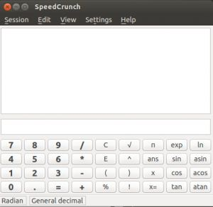

Speedcrunch
---

Baixiar pacote rpm:

    http://share.cx.com/w6FmSF

Instalar

    rpm -Uvh speedcrunch-0.10.1-3.x86_64.rpm

Gcalctool
---

Executar

    yum -y install gcalctool

### Fontes:

- [http://minimallinux.blogspot.com.br/2012/11/centos-6rhel-install-speedcrunch.html](http://minimallinux.blogspot.com.br/2012/11/centos-6rhel-install-speedcrunch.html)