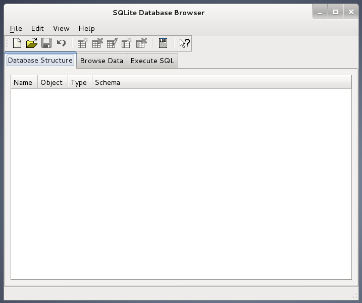

[sqlite](https://www.sqlite.org/) é um banco de dados famoso pela sua facilidade de instalação. Cada banco de dados é representado por um arquivo no disco
rígido. Exatamente por isso, ele acompanha  a distribuição de muitos outros softwares. Explico, quando o aplicativo (um qualquer) depende de um
banco de dados, o desenvolvedor pode optar por entregar o seu software juntamente com o Sqlite, pois ele é de fácil instalação. Então, vamos a receita...

Execute os comandos abaixo no terminal para instalar na família Debian/Ubuntu.

    apt-get install sqlite3
    apt-get install libsqlite3-dev

Para visualizar cada arquivo, ou melhor, cada banco de dados, você poderá instalar o aplicativo __sqlitebrowser__:

    apt-get install sqlitebrowser

No Debian, após a instalação, o aplicativo pode ser encontrado no seguinte menu: Applications/Programming/SQLite database browser.

