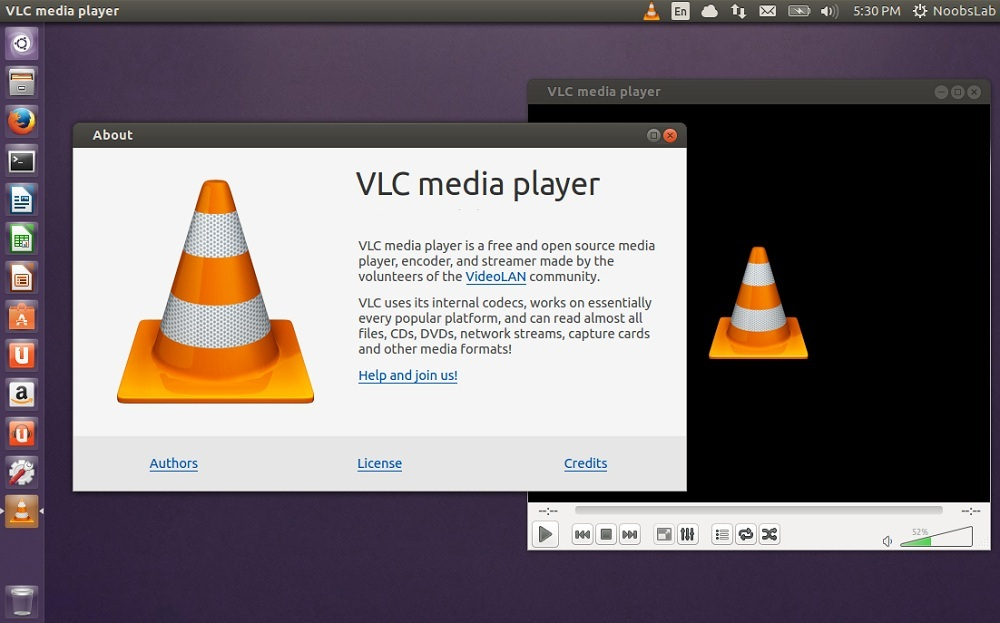
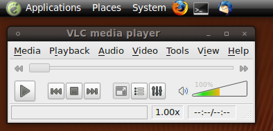

### O que é VLC ?

O __VLC__ é um player de audio e video muito bom e completo para Linux, também há versão para Windows e Mac.

### Instalando no CentOS

Vá até o diretório:

    cd /etc/yum.repos.d/

E adicione o seguinte repositório:

    wget http://pkgrepo.linuxtech.net/el6/release/linuxtech.repo

Instale o aplicativo via `yum`:

    yum install vlc

Site Oficcial
---

[www.videolan.org](http://www.videolan.org/vlc/)

