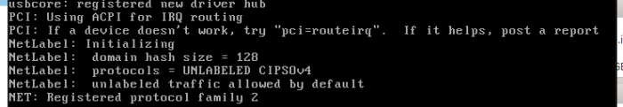
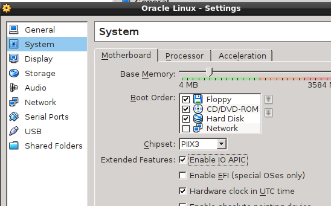

O iniciar a máquia virtual CentOS 5.6 (não confunda com a 6.5) no Virtual Box ela trava e é exibido o erro
`NET: Registered protocol family 2`, veja a imagem:

Para resolver basta habiltar a opção __Enable IO APIC__ nas configurações da máquina virtual, veja imagem:

### Fonte

- [virtual-box-net-registered-protocol-2-hang](http://m04m.com/2012/01/13/virtual-box-net-registered-protocol-2-hang/)
