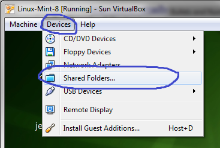
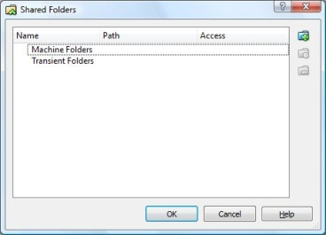
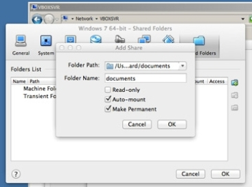
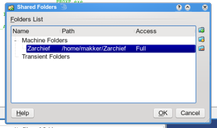

Após instalado o __Virtual Box__ uma das primeira necessidades costuma ser compartilhar pastas entre sua máquina host
(a principal) e a máquina virtual (guest).

Resumidamente, fazemos isso em 2 passos:

1. Habilitar a pasta via o menu __Devices__
2. Montar a pasta via linha de comando através do comando __mount__.

Passo a Passo (Host Linux, guest Linux)
---

Este passo a passo foi testado em uma máquina host Linux com máquina virtual também Linux.

Obs: As figuras mostram a interface do __Windows__.

Com a __máquina virtual__ aberta, clique no menu __Devices__, __Shared Folders__.

A seguinte tela se abrirá.

Agora clique no ícone __+__ (pastinha azul à direita).

A opção __Folder Path__ será a pasta na sua máquina principal (host) que você deseja enxergar dentro da vm (máquina virtual).

A opção __Folder name__ é uma "labe". Dê o nome que quiser. Utilizaremos ele em breve na linha de comando.

Deixe habilitado as checkboxes __Auto-mount__ e __Make permanent__.

Clique no botão __OK__, sua tela se parecerá com a figura abaixo.

Dê mais um __Ok__ para fechar essa tela.

Até aqui é meio caminho andado. Agora iremos para o terminal montar a pasta para o sistema poder enchargá-la.

Pense onde você quer acessar os dados? Em que local?

Eu, normalmente, uso a home do meu usuário, `home/flavio/foo`. Onde `foo` é um nome qualquer.

Você precisa definir isso antes de continuarmos.

Abra o terminal, crie a pasta `home/seu-usuario/foo`.

Como __root__ (ou utilize o utilitário `sudo` antes da instrução), execute o seguinte comando:

    mount -t vboxsf foo home/seu-usuario/foo

Ao prescionar o __enter__ não deve ser exibida nenhuma mensagem, isso significa que deu tudo certo.

Abra o __Nautilus__ (gerenciador de arquivo do Linux) e navegue até a pasta `home/seu-usuario/foo`.

Você já deve estar enxergando os arquivos.