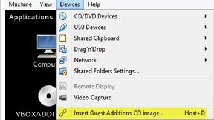

Essa receita foi testada em um __CentOS 6.4__ tanto na máquina (hospedeira) como na máquina virtual (convidado).

### Instalando as dependências

Atualize seu sistema

    yum update

Instale os headers do kernel, se não você verá a seguinte mensagem de erro
[The headers for the current running kernel were not found](../vbox-headers-for-the-current-running-kernel-were-not-found/ "The headers for the current running kernel were not found")

    yum install kernel-devel

Instale também o GCC (compilador da GNU), se não você verá a seguinte mensagem de erro __"The gcc utility was not found"__.

    yum install gcc

### Instalando o Guest Additions (adicionais de convidados)

Primeiro precisamos habilitar a pasta com os arquivos de instalação, clique no menu __"Devices"__ e  depois na opção
__"Install Guest Additions"__.

Após isso o __Vbox__ irá montar uma pasta (como se fosse um CD-ROM) com o nome `VBOXADDTIONS_XXX` onde XXX é a versão de
sua instalação.

O Linux monta as unidades na pasta `media/`. Quando clicamos no menu acima indicado, o Virtual Box montou a unidade
"VBOXADDITIONS_XXX" na pasta, então vamos até ela, digite:

    cd /media/VBOXADDITIONS_XXX

Lembre-se de trocar `XXX` pela sua versão. A minha é `4.2.18.88780` então eu digitei `cd /media/VBOXADDITIONS_4.2.18.88780`.

Agora é só executarmos o instalador:

    ./VBoxLinuxAdditions.run

Reinicie a máquina.

### Fontes:

- [https://www.virtualbox.org/manual/ch04.html#idp55330864](https://www.virtualbox.org/manual/ch04.html#idp55330864 )
- [https://www.virtualbox.org/manual/ch02.html#install-linux-host](https://www.virtualbox.org/manual/ch02.html#install-linux-host )
- [https://forums.virtualbox.org/viewtopic.php?f=3&t=39975](https://forums.virtualbox.org/viewtopic.php?f=3&t=39975 )
- [http://www.vivaolinux.com.br/dica/Como-instalar-o-Guest-Additions-no-Debian-do-Virtualbox](http://www.vivaolinux.com.br/dica/Como-instalar-o-Guest-Additions-no-Debian-do-Virtualbox )
- [http://unix.stackexchange.com/questions/18435/how-to-install-virtualbox-guest-additions-on-centos-via-command-line-only](http://unix.stackexchange.com/questions/18435/how-to-install-virtualbox-guest-additions-on-centos-via-command-line-only )
