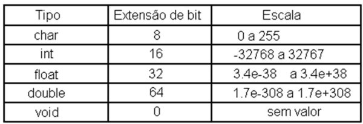
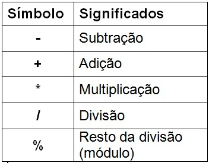
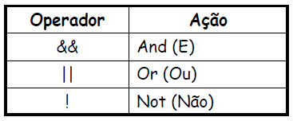
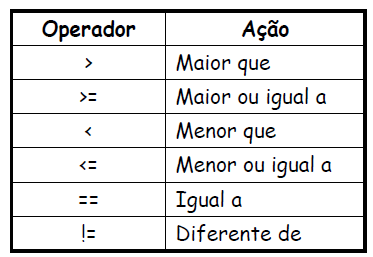
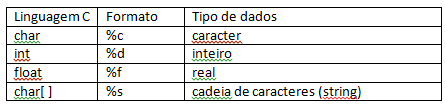

Rápida introdução a __linguagem C__. 

Ela é curta porque o objetivo é suprir o mínimo para você poder praticar os __[exercícios de lógica de programação__.

Se você chegou até esta página por vias externas veja o índice  de [lógica da programação](/../logica-de-programacao/) 
para entender melhor a proposta.

Vamos experimentar a __linguagem C__ através do [Linux](/../linux/).

Primeiro programa
---

O programa inicia-rá no bloco da função `main`.

    int main() {
        ..seu código
        ..seu código
        ..seu código
    }

Como `main` é uma função, ela deve sempre retornar algo. Por isso acrescentaremos `return 0;`.

    int main() {
        ..seu código;
        ..seu código;
        ..seu código;
        return 0;
    }

E esse "algo" é do tipo inteiro `int main() {...`.

Poderíamos escrever um programa para imprimir "Primeiro programa"

    int main (){
        printf ("Primeiro programa\n");
        return 0;
    }

Mas `printf()` é uma função, de onde vem essa função?

Vem do cabeçalho `stdio` , que é a abreviação de "standar I/O" (input/output).

    #include <stdio.h>

    int main (){
        printf ("Primeiro programa\n");
        return 0;
    }

Você deve saber como [compilar](/logica-de-programacao/como-compilar-no-linux/) o código no terminal.

Variáveis
---

A __linguagem C__ é "Case Sensitive", isto é, maiúsculas e minúsculas fazem diferença. Se declararmos uma variável com
o nome `soma` ela será diferente de `Soma`, `SOMA`, `SoMa` ou `sOmA`.

Os seguintes nomes são válidos: `minhaVariavel`, `minha_variavel` e `var1`.

Os seguintes nomes são inválidos: `minha-variavel` e `1var`.

Variáveis são espaços alocados na memória do computador.

    

Tipos
---

A __linguagem C__ possue diversos tipos, mas para começar:

* char
* int
* float
* double

Cada tipo de dados ocupa um determinado espaço na memória. Inicialmente, isso não é algo com que vamos nos preocupar.

Declarando Variáveis
---

Variáveis devem ser declaradas antes do uso. Normalmente, fazemos isso no começo do código.

    int main () {
        float valorFracionado , saldo , salarioMinimo;
        char letra , ultimaLetra;
        int entrada1 , entrada2, entrada3;
    }

Também podemos declarar e inicializar variáveis.

    int main () {
        float saldo = 0.0
        char letra = "a";
        int entrada1 = 9;
    }

Operadores...
---

### Artiméticos

### Lógicos

### Relacionais

Saída de dados
---

