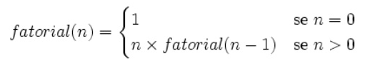

Exercício de lógica de programação
---

Faça um programa que calcule o fatorial de um número qualquer.

Vamos lembrar o que é o fatorial?

Seja `n` um número natural, tal que `n` >= 2, chama-se fatorial de `n` o produto de todos os números naturais
consecutivos de `n` até 1.

Por exemplo,

    5! = 1 x 2 x 3 x 4 x 5 = 120

Veja mais alguns resultados e que você poderá utilizar como testes:

    0! = 1
    1! = 1
    2! = 2
    3! = 6
    4! = 24
    5! = 120
    6! = 720

Atente que `0! = 1` porque o produto vazio (produto de nenhum número) é `1`.



Agora é só trabalhar, não vale ver as respostas!!!!

<iframe width="560" height="315" src="https://www.youtube.com/embed/Hvtl_UycWrg" frameborder="0" allow="autoplay; encrypted-media" allowfullscreen></iframe>


Resultados
---

Vamos iniciar as soluções em JavaScript só que sem recursividade, só para termos um comparativo de como ficaria a
solução de forma iterativa (sem recursão).

```javascript
var assert = require('assert');

function fatorial(n) {
    if (n == 0) {
        return 1;
    }
    var resp = n;
    while (n > 2) {
        resp *= --n;
    }
    return resp;
}

try {

    assert.equal(1, fatorial(0));
    assert.equal(1, fatorial(1));
    assert.equal(2, fatorial(2));
    assert.equal(6, fatorial(3));
    assert.equal(24, fatorial(4));
    assert.equal(120, fatorial(5));
    assert.equal(720, fatorial(6));

} catch(e) {
    console.log(e);
}
```

Solução em C...

```c
#include <stdio.h>
#include <assert.h>

int fatorial(int n) {
    if (n == 0)
        return 1;
    else
        return (n * fatorial(n - 1));
}

int main() {
    assert(1   == fatorial(0));
    assert(1   == fatorial(1));
    assert(2   == fatorial(2));
    assert(6   == fatorial(3));
    assert(24  == fatorial(4));
    assert(120 == fatorial(5));
    assert(720 == fatorial(6));
    return 0;
}
```

Solução em Python...

```python
# -*- coding: utf-8 -*-

def fatorial(n):
    if n <= 1:
        return 1
    else:
        return n * fatorial(n - 1)

assert 1   == fatorial(0)
assert 1   == fatorial(1)
assert 2   == fatorial(2)
assert 6   == fatorial(3)
assert 24  == fatorial(4)
assert 120 == fatorial(5)
assert 720 == fatorial(6)
```