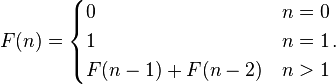




Exercício de lógica de programação
---

Faça um programa que calcule a sequencia de Fibonacci.

Vamos lembrar o que é o sequencia de Fibonacci?

É uma sequencia de números inteiros, começando normalmente por 0 e 1, na qual, cada termo subsequente (número de 
Fibonacci) corresponde a soma dos dois anteriores.

A sequência é definida pela fórmula abaixo.



Os primeiros números deste sequencia seria...

    1, 1, 2, 3, 5, 8, 13, 21, 34, 55, 89, 144, 233, 377, 610, 987, 1597, 2584

Então, podemos utilizar como testes os resultados abaixo.

    fib(1) == 1
    fib(2) == 1
    fib(3) == 2
    fib(4) == 3
    fib(5) == 5
    fib(6) == 8

Agora é com você, não vale ver as respostas!!!!


Resultados
---

Vejamos a solução em Python.

```python
def fib(n):
    if n == 1 or n == 2:
        return 1
    return fib(n-1) + fib(n-2)

assert fib(1) == 1
assert fib(2) == 1
assert fib(3) == 2
assert fib(4) == 3
assert fib(5) == 5
assert fib(6) == 8
```

Ainda em Python vejamos a solução iterativa.

```python
def fib(n):
    a, b = 1, 1
    for i in range(n-1):
        a, b = b, a+b
    return a
```


Desafios
---

Escreve a solução em C e em JavaScript.

E fique a vontade se quiser compartilhar.
