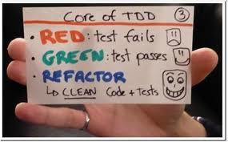

Estou muito feliz de poder introduzir a técnica de TDD no curso de lógica e com isso trazer
(bem cedo) a você um assunto que muitos profissionais tardaram por aprender. Confesso que
esse também foi o meu caso.

Eu não quero "vender o peixe" do TDD para você, mas me sinto obrigado a mostrar algumas boas
razões do "por quê" é interessante utilizar o TDD. Vou fazer isso explicando, brevemente, como
o TDD surgiu na minha vida.

TDD também é assunto sobre testes unitários (obviamente). A primeira vez que eu ouvi sobre
testes unitários eu "torci o nariz". Ora, imagine que você acabou de criar uma função e agora
resolva escrever um teste para ela com o objetivo de ter certeza de que a função está funcionando
corretamente. É suspeito quando o programador escreve teste para seu próprio código. Essa
é a minha opinião. Você não acharia suspeito? Talvez seja por isso que existem os "testadores",
aqueles caras que testam a aplicação que alguém codificou. Isso melhora um pouco o quadro
mas eu ainda continuo com a "pulga atrás da orelha".

Por essas e outras, eu nunca dei muita atenção para testes unitários. E se você quiser saber,
ainda hoje eu mantenho a mesma opinião. Acho um tanto quanto inútil testes escritos depois que
o código está pronto. Essa atitude me ajudou muito, pois eu era obrigado a rever, rever, rever, rever e rever
muito os meus códigos e, modéstia à parte, dificilmente eu inseria um bug. O que me fez crer
menos ainda em testes unitários.

Um belo dia me deparei com a sigla TDD e fui buscar seu significado: "testes unitários realizados
ANTES da codificação", fiquei intrigado mas não dei a devida atenção porque já tinha minha
opinião formada sobre testes unitários. Cometi um erro, estava confundindo TDD com Testes unitários,
mas só fui descobrir isso com ajuda de um amigo.

Um outro belo dia, esse meu amigo ([Marcus Vinícius](https://github.com/marcusesa)evangelista PHP)
apareceu lá na escritório e me mostrou a técnica. De forma bem simples, prática e direta ele disse:

1. Pense melhor no que você quer fazer
2. Escreva um teste imaginando que sua aplicação já esteja funcionando
3. Se você rodar os testes, verá que eles falharam (luz vermelha).
4. Então, agora escreva sua aplicação...

Eu, com sou "apressadinho", já fui logo implementando a função e o (Santo) Marcus me iluminou:

"Negativo, codifique apenas o mínimo necessário para o teste passar."

5. Rode o teste, luz verde? sim, então...
6. Amplie seu teste para outras possibilidades
7. Rode os testes, luz vermelha?
8. Codifique até que a luz fique verde

Neste ponto, eu o interrompi com um palavrão... ril, minha "ficha caiu".

Escrever o teste antes muda tudo!

O TDD agrega um verdadeiro valor aos testes unitários. As suspeitas de que os testes possam
estar viciados ou mesmo falhos caem por água abaixo. Eu continuo não acreditando nos testes
escritos "depois", mas os testes escritos "antes" fazem parte do meu dia a dia como programador.

Importante dizer que eu não sou especialista em TDD. Eu me inspirei em incluir o TDD aqui
no curso de Lógica por duas razões:

+ Há pouco material sobre o assunto
+Eu gostaria de ter aprendido sobre TDD mais cedo

Pensando nisso, surgiu a seguinte pergunta: Em que momento do tempo o programador deve aprender TDD?

Eu estou sugerindo que o quanto antes melhor, de preferência quando aprendemos lógica de programação.

Espero que a "ficha caia" para você também.

## O TDD de Kent Bech

Acrônimo para Test Driven Development (desenvolvimento guiado por testes).

Com vocês o culpado pelo surgimento da técnica... Kent Bech!

<blockquote>

    <strong>Código limpo que funcione</strong>, [...] é o objetivo do TDD. Código limpo que
    funciona é uma meta valiosa por um bocado de razões.

<ul>
    É uma forma previsível de desenvolver. Você sabe quando acabou sem ter que se preocupar com uma longa trilha de erros.
    Dá a você uma chance de aprender todas as lições que o código tem para ensinar. Se você fizer às pressas a primeira coisa que pensar, então nunca terá tempo para pensar em uma segunda coisa melhor.
    Melhora as vidas dos usuários de seu software
    Permite que seus colegas de equipe contem com você, e você com eles.
    É bom escrevê-los
</ul>

    Mas como obtemos código limpo que funciona? Muitas forças nos desviam do código limpo, ou
    mesmo de código que funciona. Sem pedir conselhos aos nossos medos, aqui está o que fazemos:
    conduzimos o desenvolvimento com testes automatizados, um estilo de desenvolvimento chamado
    Desenvolvimento Guiado por Testes. No TDD:

<ul>
    Escrevemos código novo apenas se um teste automatizado falhou
    Eliminamos duplicação
</ul>

    Essa são duas regras simples, mas geram um complexo comportamento individual e de grupo com
    implicações técnicas, tais como:

<ul>
    Devemos projetar organicamente o código, executando e fornecendo feedback entre as decisões.
    Devemos escrever nossos próprios testes, pois não podemos esperar 20 vezes por dia para outra pessoa escrever um teste.
    Nosso ambiente de desenvolviemnto deve fornecer resposta rápida a pequenas mudanças.
    Nosso projeto deve consistir em muitos componentes altamente coesos e fracamente acoplados para tornar os testes fáceis
</ul>

    As duas regras implicam em uma ordem para as tarefas de programação.

<ol>
    <strong>Vermelho</strong> - Escrever um pequeno teste que não funcione e que talvez nem mesmo compile inicialmente.
    <strong>Verde</strong> - Fazer rapidamente o teste funcionar, mesmo cometendo alguns pecados necessário no processo.
    <strong>Refatorar</strong> - Eliminar todas as duplicatas criadas apenas para que o teste funione.
</ol>
<strong>Vermelho/verde/refatorar - o mantra do TDD</strong>

    <small>Fonte: Kent Bech no prefácio de seu livro "TDD Desenvolvimento Guiado por Testes"</small>

</blockquote>

## Ferramentas para teste unitários

### PHP -> phpunit

Para PHP, temos o PHPUnit, ferramenta desenvolvida por Sebastian Bergmann.
É de fácil instalação, siga os passos neste pequeno guia: [Instalando o PHPUnit no Linux](/linux/instalando-phpunit/)

Para testar a instalação digite no terminal do linux:

    phpunit --version

A versão instalada é mostrada!

Para executar digite:

    phpunit SuaClasseTest.php

Veja um exemplo neste [Gist](https://gist.github.com/flaviomicheletti/8041173)

### JavaScript -> QUnit

Para JavaScript, temos uma boa opção (principalmente por ser fácil de usar) é o QUnit, do mesmo criador do JQuery 
(John Resig).

Crie um HTML e um JS como o mostrado abaixo:

<pre><code>&lt;!DOCTYPE html&gt;
&lt;html&gt;
    &lt;head&gt;
        &lt;meta charset="utf-8"&gt;
        &lt;title&gt;QUnit Example&lt;/title&gt;
        &lt;link rel="stylesheet" href="/resources/qunit.css"&gt;
    &lt;/head&gt;
    &lt;body&gt;

        &lt;div id="qunit"&gt;&lt;/div&gt;
        &lt;div id="qunit-fixture"&gt;&lt;/div&gt;

        &lt;script src="/resources/qunit.js"&gt;&lt;/script&gt;
        &lt;script src="/resources/tests.js"&gt;&lt;/script&gt;

    &lt;/body&gt;
&lt;/html&gt;</code></pre>
                            
<pre><code>test( "hello test", function() {
    ok( 1 == "1", "Passed!" );
});</code></pre>
                            
Abra o arquivo HMTML no navegador para ver o resultado.

