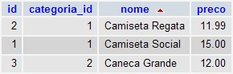

Introdução
==========

    
    
O Excel foi, é e sempre será utilizado indevidamente como banco de dados.

    
Fonte:<a href="http://vidadeprogramador.com.br/2011/05/24/banco-de-dados/">Vida de programador</a>

Seu eu começasse essa seção com "Na década de 70..." a matéria perderia a graça, aprender deve ser divertido.

Hum Hum! tudo bem vamos lá...

Na década de 70 um pesquizador chamado Edgar Frank "Ted" Codd desenvolveu um produto de modelo de dado relacional 
chamado SEQUEL (Strutucred English Query Language, Linguagem de Consulta em Inglês Estruturado) que mais tarde veio a
se tornar o nosso conhecido SQL (Structured Query Language, Linguagem de Consulta Estruturada).

    
    
Edgar Frank Codd (1923-2013) Pai da SEQUEL

Em pouco tempo a ANSI (American National Standards Institute) assumiu os trabalhos padronizando a SQL. Mas como tudo em
nossa área, a padronização tem suas exceções. Existem os dialetos SQL, cada sistema de banco de dados implementou sua
própria versão  da padronização (é para rir ou para chorar?). 

Alguns anúncios de emprego especificam o dialeto como requisito para a vaga.

Você já viu pedirem experiência em T-SQL ou PL/SQL ? Vejamos os pricipais dialetos:

    
    
Dialetos SQL

Na verdade, o quadro não é tão ruim assim. Se você domina um dialeto, terá facilidade para migrar para outro. Segundo
os irmãos Kline autores do livro "Sql - O Guia Essencial - Manual de Referência Profissional, 3 edição":

>> Programadores e administradores agora têm o benefício de serem capazes de aprender uma única linguagem que, com
>> pequenos ajustes, é aplicável a uma vasta variedade de plataformas de banco de dados, aplicações e produtos.
<small>Daniel e Kevin</small>

Neste curso, eu abordarei o dialeto MySql e já que estamos falando sobre o curso...

Sobre o Curso
-------------

Eu estava na dúvida se fazia um curso apenas de SQL ou se envolvia um Banco de Dados. É certo que a SQL é um padrão (ou
pelo menos deveria ser) e que indepênde de banco de dados, mas por outro lado, *como aprender SQL sem ao menos um banco
de dados?*

Minha escolha pelo MySql é óbvia: é um DB "pau para toda obra", é o companheiro inseparável do PHP e é muito fácil
começar por ele.

*Se o curso é sobre SQL porque chama-se Mysql?*

É porque eu não gostaria que alguém que estivesse procurando por SQL, entra-se no curso achando que vai aprender apenas
SQL e na verdade irá aprender SQL juntamente com o MySql. Pode parecer bobagem mas eu quis tomar esse cuidado.

Esse é um curso de *SQL através do MySql*.

Nós vamos começar pelo console e depois partiremos para o Phpmyadmin (interface com o banco).

DB = BD = SGBDR
----------------

"Banco de dados" abreviamos para *BD*.

Em inglês, "Data Base" abreviamos para *DB*.

Alguém que não tinha nada para fazer, resolveu ajudar e criou mais um termo SGBDR, Sistema Gerenciador de Banco de Dados
Relacional.

Eu gosto de utilizar a forma em inglês DB, é essa que você verá aqui no curso.

Banco de dados
--------------

Banco de dados nada mais é que um sistema capaz de armazenar e recuperar uma grande quantidade de dados.

Novamente os irmãos Kline nos dão mais dicas sobre o que é um SGBDR:

> Um SGBDR é definido como um sistema que usuários observam dados como uma coleção de tabelas relacionadas entre si
através de valores de dados comuns.

Tabelas, Registros e Colunas
----------------------------

#### Colunas

São os *campos* de uma informação, por exemplo: 
    
    nome do produto, preco

...são dois possíveis campos (ou  colunas)

#### Registros

São os dados abaixo dessas colunas:

    Camiseta Regata, 11.99 -- esse é um registro
    Camisa Social,   15.00 -- esse é outro registro

#### Tabelas

Se juntarmos as colunas e os registros teremos as tabelas:

    
    
Fonte da imagem: 
        <a href="http://blog.thiagobelem.net/relacionamento-de-tabelas-no-mysql/">Blog do Thiago Belem</a>
    

#### DB

Agora me responda sem pensar muito, o que é um conjunto de tabelas ?

... nosso banco de dados.

A imagem abaixo ilustra nosso banco de dados:

    
    

        <a href="http://www2.itssolucoes.com.br/banco-de-dadoss">Fonte da imagem</a>
    

Os cilindros azul e verde representam um banco de dados, os quadros abaixo deles representam nossas tabelas,
esses quadros estão no formato ER, *diagrama Entidade Relacionamento*, falaremos disso em breve.

Mas a figura oficial de um banco de dados é esta aqui:

    
    
Isto sim é um Banco de Dados

Eu quiz apenas introduzir os conceitos de forma intuitiva, falaremos exaustivamente "dessas coisas" no decorrer do curso.

Instalando o mysql
------------------

O software, normalmente, se divide em duas partes: servidor e cliente.

Existe a aplicação que roda lá no servidor e existe um pequeno emaranhado do código que roda no cliente. 

Como desenvolvedor, eu instalo na minha máquina as das partes. "Mel na chupeta', essa expressão é tão velha quanto
a forma como instalamos o mysql (no linux).

No Ubuntu (família Debian) digite:

    apt-get install mysql-server mysql-client

Enquanto os arquivos são baixados e instalados o sistema lhe perguntará qual será a senha do root (para acessar o banco de dados), anote-a.

No Fedora (família Had-Hat) é parecido, só que você é quem define a senha:

    yum install mysql mysql-server

inicie o serviço...

    systemctl start mysqld.service
    systemctl enable mysqld.service

e habilite a senha digitando...

    mysqladmin -u root password [your_password_here]

Se tudo ocorreu bem poderemos acessar o servidor mysql via console.

MySql via console (terminal)
-----------------

Para testarmos a instalação do mysql nada melhor do que acionarmos o aplicativo.

O MySql utiliza o diretório "mysql" como diretório atual. Como exemlo veja o meu diretório autal:

    [flavio@localhost www.devfuria.com.br]$

... ao entrar no Mysql meu diretório atual fica como abaixo:

    mysql>

No console, é possível digitar "mysql" para entrar no servidor mysql, mas se digitar apenas isso receberemos a seguinte
mensagem:

    ERROR 1045 (28000): Access denied for user 'flavio'@'localhost' (using password: NO)

Bom começarmos com um erro pois dessa forma você irá se habituando a "encarar" essas mensagens ao invés de ignorá-las
(atitude comum de quem está iniciando).

*O que podemos descobrir com a menssagem?* Olha para ela atentamente e absorva todos os detalhes.

1. Primeiro sabemos o número do erro o que nos ajudará a fazer uma possível pesquisa na web e ter a certeza de que estamos
tratando do mesmo erro.

2. Depois temos a descrição do erro: "Access denie", traduzindo, "Acesso negado". Mas acesso negado para quem? para qual
usuário? Leia a mensagem e descobrirá. No meus caso, mostrou o meu usuário do linux: "flavio". O arroba separa o usuário
do local no qual está instalado o servidor mysql. Como estou na minha máquina local le acusa "localhost", traduzindo porcamente,
máquina local.

3. Por último temos a seguinte informação: (using password: NO), ou seja, "usando senha: Não", quer dizer que realizou
uma tentiva de login sem senha.

Viu como é importante ler atentamente as mensagens de erros? Aprendemos muito com elas.

*Então, como então acessamos o servidor via console?*

    mysql -h localhost -u root -p

Vamos entender o comando acima. 

    mysql      -- evocamos o servidor
    -h         -- dizemos que o próximo dado é referente ao host
    localhost  -- informamos o o host
    -u         -- dizemos que o próximo dado é referente ao usuário
    root       -- informamos o usuário
    -p         -- dizemos que o próximo dado é referente a senha

Não vamos digitar a senha porque pode ter alguém bisbilhotando (rsrs). Então acionamos o Enter e adivinhe? O console
solicita a senha do usuário infrmado. Agora sim pode digitar, pois a senha não é mostrada.

Espero que você esteja vendo o mesmo que eu:

    
    
Logado no MySql via console

Agora já é possível testar e aprender sobre os *statements*.

#### Saindo do mysql

Digite:

    exit

O sistema responde com um simpático "Bye"... eu também, tchau!
