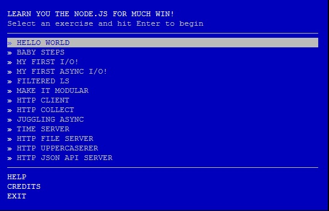

A Nodeschool teve uma idéia genial, criou um curso interativo de __Node.js__, o mais legal é que ele é gratuito.
Digo mais, ele é do tipo "self service"! Você instala o programa __learyounode__ que é escrito em __JavaScript__ e
feito para rodar no __Node.js__. Ele possui uma lista com 13 exercícios que você vai desenvolvendo e conferindo com a
ajuda do programa.

A primeira coisa que você precisa fazer é [instalar o Node.js no Linux](/linux/instalando-nodejs/).

A segunda coisa é [instalar o NPM](/linux/instalando-npm/) que nada mais é do que é um repositório online para publicação
de projetos de código aberto para o __Node.js__.

Com o __Node.js__ e o __NPM__ devidamente instalados, podemos instalar o __learyounode__.

Execute como usuário normal...

    npm install -g learnyounode

Para testar a instalação execute `learnyounode -v`, ele mostrará a versão instalada.

Para iniciar a aplicação digite...

    learnyounode

Aprendendo Node.js com o leranyounode
---

Eis a tela inicial do programa learnyounode.

Você escolhe o exercício e o leranyounode irá mostrar as instruções para realizá-lo.

Você deve criar um arquivo JavaScript com qualquer nome, por exemplo `foo.js` e escrever sua solução nele.

Quando achar que está pronto, execute `learnyounode verify program.js` para checar sua resposta.

Se estiver tudo ok, o programa além de mostrar o resultado esperado marcará como feito o exercício.

Experimente!

### Dica

O programa irá fornecer argumentos para seu programa quando você rodar...

    learnyounode verify program.js`

..., então você não precisa se preocupar em fornecê-los. Para testar seu programa sem a verificação, você pode
invocá-lo com...

    learnyounode run program.js.

Quando você usa `run` você está invocando o ambiente de testes que o learnyounode prepara para cada exercício.
