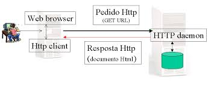

Esta não é um artigo formal, nem acadêmico, sobre o protocolo HTTP, se você precisa dessas informações para seu TCC ou
qualquer outro trabalho escolar, que tal dar uma olha nesta [documentação](http://docs.w3cub.com/http/).
Neste artigo eu quero passar para você uma forma bem prática de como os verbos GET e POST são regidos pelo protocolo HTTP.

## O protocolo HTTP

Não dá para falar sobre os verbos POST e GET sem introduzir o protocolo HTTP, ou será que dá ? Acho que não, mas como fazer
uma apresentação formal do protocolo não é o objetivo deste artigo (como já foi dito) eu vou deixar aqui uma "breve noção"
do que vem a ser o HTTP.

O Hypertext Transfer Protocol, é um protocolo de comunicação utilizado para sistemas de informação de hipermídia,
distribuídos e colaborativos. Ele é definido pela especificação" [rfc2616](https://tools.ietf.org/html/rfc2616)

<iframe width="560" height="315" src="https://www.youtube.com/embed/fhAXgcD21iE?rel=0" frameborder="0" allowfullscreen></iframe>

Se você assitiu ao vido acima, percebeu que sempre caímos nas requisições (pedidos) e respostas. Elas são o objeto de
estudo deste artigo.




## Requisição

A requisição compreende três elementos:


- Uma linha de pedido:

    ```
    POST /www.devfuria.com.br/script-para-onde-envio-os-dados.php HTTP/1.1
    ```

- Os campos de cabeçalho do pedido

    ```
    Host: localhost

    User-Agent: Mozilla/5.0 (X11; Linux x86_64; rv:24.0) Gecko/20100101 Firefox/24.0
    ... eu apaguei as demais linhas
    ```

- O corpo do pedido

    ```
    email=joao@dasilva.com
    username=João da Silva
    ```

A requisição acima foi gerada pelo formulário web ilustrado abaixo


Repare que os campos viraram um par `nome=valor` no corpo do pedido.

Essa "mágica" eu mostro na próxima matéria.


## Resposta

A resposta também compreende três elementos:

- Uma linha de estatuto:

    ```
    HTTP/1.1 200 OK
    ```

- Os campos de rúbrica da resposta

    ```
    Date: Fri, 31 Jan 2014 14:03:55 GMT
    Server: Apache/2.2.15 (CentOS
    ... eu apaguei as demais linhas
    ```

- O corpo da resposta

    ```
    Aqui é documento (normalmente HTML) de resposta
    ```

Repare na "linha de estatuto" que temos o código de resposta `200` e sua descrição `OK`.

Abaixo temos as 4 respostas mais encontradas.

<div class="bs-example">
    <table class="table  table-striped">
        <tr>
            <th class="text-center">Código</th>
            <th class="text-center">Mensagem</th>
            <th class="text-center">Descrição</th>
        </tr>
        <tr>
            <td>200</td>
            <td>OK</td>
            <td class="text-left">O pedido foi realizado corretamente</td>
        </tr>
        <tr>
            <td>301</td>
            <td>MOVED</td>
            <td class="text-left">Os dados pedidos foram transferidos para um novo endereço</td>
        </tr>
        <tr>
            <td>404</td>
            <td>NOT FOUND</td>
            <td class="text-left">Clássico! O servidor não encontrou nada no endereço indicado. Partiram sem deixar endereço…:)</td>
        </tr>
        <tr>
            <td>500</td>
            <td>INTERNAL ERROR</td>
            <td class="text-left">O servidor encontrou uma condição inesperada que o impediu de satisfazer o pedido (às vezes acontecem coisas aos servidores…)</td>
        </tr>
    </table>
</div>


## GET

O método pode ser gerado por um formulário web e também por um link em sua página HTML. Ele possui limite de capacidade
e a URL só aceita (obviamente) strings, se você precisar passar arquivos deverá utilizar o POST.

O método GET utiliza a própria URI (normalmente chamada de URL) para enviar dados ao servidor,
quando enviamos um formulário pelo método GET, o navegador pega as informações do formulário
e coloca junto com a URI de onde o formulário vai ser enviado e envia, separando o endereço
da URI dos dados do formulário por um “?” (ponto de interrogação).

Ao final da URL colocamos o sinal `?` e utilizamos a combinação `nome=valor` separados pelo sinal `&`.

Também podemos utilizar o formulário web com a propriedade `metho` "setada" como `get`, exemplo:

    <form method="get" >


## POST

O método só pode ser gerado através de um formulário web (ou através de AJAX), não dá para um link gerar o método post.
Na verdade até dá, com uso de JavaScript podemos ler os campos, criar a URL e enviar tudo via AJAX, só que saímos do
campo de Back End e adentramos o campo do Front End.

O método POST é mais seguro que o GET! <strong>Besteira, ele é tão inseguro quanto o GET.</strong> Só porque o usuário
não vê os dados na URL não quer dizer que eles (os dados) estão protegidos.

Se a questão é segurança, eu posso te dar uma certeza: tem muita ladainha na net. Mas se quiser um lugar para começar,
então veja a nossa seção sobre [segurança da informação](/seguranca-da-informacao/)

Todo controle colocado dentro do formulário web com a propriedade `name` preenchida gera um par `nome=valor` para ser
enviado no servidor.

Na matéria seguinte veremos passo a passo como gerar as requisições, tanto em GET como em POST.


## Sem estado (state less)

Eis o ponto central de uma aplicação web: ela é construída sobre um protocolo sem estado.

Por "sem estado", queremos dizer que cada requisição não tem conhecimento de outra requisição e isso muda tudo: muda a
lógica, muda a organização, muda a arquitetura. Você precisará entender e se acostumar com essa característica das
aplicações web.

Um dos desafios do desenvolvimento de uma aplicação web é justamente esse: sua perda de estado.

Para ajudar a solucionar essa questão existem mecanismos como as session (sessão) e os cookies. Eles são espaços onde
podemos anotar alguma informação e utilizá-la enquanto a sessão estiver ativa (válida). Mas isso é assunto para outro
artigo.


## Exercícios

Este artigo foi mais teórico do que prático, não teremos um exercício em específico, mas que tal você buscar em outras
fontes o reforço dos seguintes conceitos:

1. Aplicação state less
2. Respostas do protocolo HTTP
3. Funcionamento de um formulário web
4. As principais diferenças entre GET e POST
