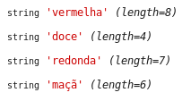

> Um array no PHP é atualmente um mapa ordenado. Um mapa é um tipo que relaciona valores para chaves. Este tipo é 
> otimizado de várias maneiras, então você pode usá-lo como um array real, ou uma lista (vetor), hashtable (que é uma 
> implementação de mapa), dicionário, coleção, pilha, fila e provavelmente mais. Como você pode ter outro array PHP como 
>um valor, você pode facilmente simular árvores.
>
> <small>Fonte: Manual do PHP - arrays</small>

O índice do primeiro valor é zero.

Criando
---

Criando um array vazio.

    $arr = array();

Se executarmos `var_dump($arr)` veremos que o array está vazio.

Criando um array com valores conhecidos

    $arr = array(10, 11, 12, 13);

Resultado

Outro exemplo.

    $arr = array("melancia", "banana", "laranjas", "abacates");

Quando o array acima cresce e fica grande demais para caber em 120 colunas temos como opção a forma abaixo.

    $arr = array(
        "melancia",
        "banana",
        "laranjas",
        "abacates"
    );

Criando dinâmicamente
---

Essa é uma forma interessante, simplesmente vamos atribuindo valores ao array.

    $arr = array();
    $arr[] = 10;
    $arr[] = 11;
    $arr[] = 12;
    $arr[] = 13;

A função interna do PHP `array_push` ilustrada abaixo faz exatamente o mesmo que o código acima.

    $arr = array();
    array_push($arr, 10);
    array_push($arr, 11);
    array_push($arr, 12);
    array_push($arr, 13);

Especificando as chaves
---

Podemos especificar as chaves do array no momento da criação.

    $arr = array(
        "nome" => "Paulo Silva",
        "rua" => "Rua 25 de Março",
        "bairro" => "Centro",
        "cidade" => "São Paulo"
    );

O array acima é ilustrado abaixo.

Outro exemplo

    $arr = array(
        100 => "Primeiro item",
        101 => "Segundo item",
        102 => "Terceiro item",
        103 => "Quarto item"
    );

Resultado:

Array numérico
---

Um array é dito numérico quando as chaves (key) são inteiros.

    $arr = array(
        0 => "vermelha",
        1 => "doce",
        2 => "redonda",
        3 => "maçã"
    );

Array associativo
---

Um array é dito associativo quando as chaves (key) são strings.

    $arr = array(
        "cor" => "vermelha",
        "sabor" => "doce",
        "formato" => "redonda",
        "nome" => "maçã"
    );

Também dá para fazer o array misto (associativo e numérico)

Iterando com foreach
---

Tomando o último array como exemplo:

    $arr = array(
        "cor" => "vermelha",
        "sabor" => "doce",
        "formato" => "redonda",
        "nome" => "maçã"
    );

Para percorrer(iterar) esse array e imprimir os resultado usamos o laço `foreach`.

Mostrando só valor __foreach (array_expression as $value)__:

    foreach($arr as $valor) {
        var_dump($valor);
    }

Resultado:

Mostrando o valor e a chave __foreach (array_expression as $key => $value)__:

    foreach($arr as $chave => $valor) {
        var_dump($chave. " - " . $valor);
    }

Resultado:

Fonte: [Manual do PHP - foreach](http://www.php.net/manual/pt_BR/control-structures.foreach.php "link-externo")

Iterando com while
---

Tanto...

    while ($cad_pos = current($arr)) {
        $key = key($arr);
        var_dump("$key - " . $posicoes[$key]);
        next($arr);
    }

...quanto:

    while ($cad_pos = current($arr)) {
        $key = key($arr);
        var_dump("$key - " . $cad_pos);
        next($arr);
    }

Chegam no mesmo resultado:

Fonte: [Manual do PHP - while](http://www.php.net/manual/pt_BR/control-structures.while.php "link-externo")