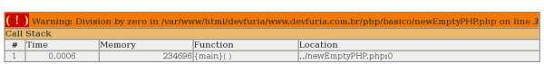

Debugar é um esforço para encontrar determinado ponto (às vezes vários pontos) "defeituoso" no código à ser corrigido.

Ao sentar-se na frente do computador para codificar (seja lá o que for) o desenvolvedor estabelece, ou deveria estabelecer,
uma conversa com o computador e seu código fonte:

    dev: E aí computer, me mostre o VALOR da variável "resultado".

    cpu: Ok, mas parece que não está retornando nada, veja o valor que ela contém... "".

    O dev para e pensa um pouco: Qual será o tipo do dado, pois o valor não está ajudando muito.

    dev: Computer, mostre-me agora TIPO de dado da variável "resultado".

    cpu: string(0)

O dev novamente reflexivo: "O valor é '', o tipo é string. Acho que vou 'parar' em outro ponto..."

Esse é o processo de depuração, ir parando em determinados pontos do código fonte e pedir para o computador mostrar o que
vai em sua memória.

Na verdade essa é a forma mais rudimentar de depuração, porém é bastante eficaz.

Em PHP, podemos simplesmente pedir para o script mostrar o valor de determinada variável.

```php
<?php
$minha_var = "qualquer coisa";
echo $minha_var;
```


O `echo` mostrará apenas o valor da variável e não mostrará outras informações como, por exemplo, o tipo de dado.

Seria muito útil dar mais dicas além do simples valor da variável.


Debugando com var_dump()
---

Para contornar isso, o php conta com a função `var_dump()`.

Devemos passar como parâmetro a variável a ser analisada.

```php
<?php
$minha_var = "qualquer coisa";
var_dump($minha_var);
```

Dependendo do seu objetivo, devemos interromper o script, para isso usamos a função `die()`;

```php
<?php
$minha_var = "qualquer coisa";
var_dump($minha_var);
die();

...mais códigos
...mais códigos
...mais códigos
```

A imagem abaixo mostra o resultado do `var_dump()`:

")


É possível passar n variáveis, basta separá-las por vírgula


### x-debug()

Para se beneficiar 100% da função `var_dump()` devemos ter instalado o programa __x-debug__. Ele exibi-rá o resultado de
uma forma mais legível.

Veja o artigo [Instalando o x-debug no Linux](/linux/instalando-xdebug/) para aprender como insta-lá-lo.

Obviamente, não é só essa a função do x-debug, ele faz muito mais do que isso, inclusive pode ser integrado a IDE
[Netbeans](/linux/instalando-netbeans/) e outras "pequeñas cosas".

Caso o seu script gere um erro me tempo de execução o x-debug mostrará o rastro que seu script deixou. Dá para ver o
caminho percorrido facilitando, dessa forma, a depuração.

Nesse caso, ele trás várias informações e leitor deve acostumar-se a "extrair" essas informações.



1. Temos o tipo de erro: Warning
2. O erro propriamente dito: Division by zero.
3. O script na qual ocorreu o erro
4. A linha desse script
5. O Call Stack, que mostra a senquência de execução, o tempo levado e a memória utilizada.

São informações valiosas para quem está debugando.

Ele é uma "mão na roda", depois que você se acostuma, não consegue mais viver sem ele.


### Caso você não tenha o x-debug instalado

Há uma saída simples, mas cansa ficar digitando isso sempre.

Por essa razão, considero ser uma saída paliativa. Ótima para quando não possui ( ou não pode ter ) o x-debug instalado.

Normalmente o ambiente de produção não possui o x-debug instalado, então lanço mão do seguinte código:

```php
<?php
$minha_var = "qualquer coisa";
echo "<pre>";
print_r($minha_var);
echo "</pre>";
```


O código acima utiliza a função `print_r()` junto com as tag HTML `<pre></pre>`. O resultado exibe os dados na forma em
que ele é disposto, melhorando um pouco a apresentação.

Juntos, o `print_r()` e a tag `<pre>`, tornam o resultado bastante legível.


### Mas eu só queria ver o valor de uma variável!!!

O nosso exemplo é bem simples e talvez o leitor não tenha notado o quanto é importante essa questão da exibição.

Mas quando você estiver debugando valores de uma array, por exemplo, você irá se lembrar dessa matéria.

Apenas para ilustrar, tente executar os código abaixo:

    echo $_SERVER;

Agora experimente:

    var_dump($_SERVER);

Caso não tenha o x-debug instalado, use:

    echo "<pre>";
    print_r($_SERVER);
    echo "</pre>";

E aí, sentiu a diferença?
