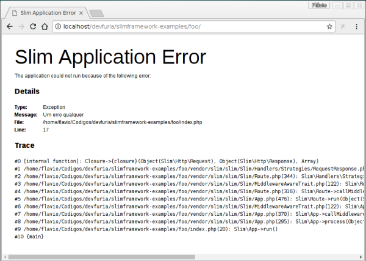
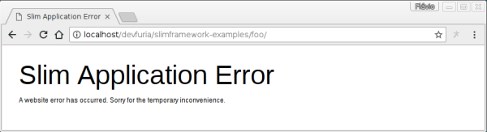

No artigo anterior vimos como instalar o Slim e criamos um Hello World.

Neste artigos vamos aprender como exibir os detalhes no caso de um erro ser lançado pelo PHP.

O Slim permite configurar a aplicação atraves de uma variável qualquer (por convenção utilizaremos `$config`). Passe
sua variável no momento que instancia a classe base do Slim, veja exemplo abaixo.

```php
<?php

//
// code
//

$config = [
    'settings' => [
        'displayErrorDetails' => false # change this <------
    ],
];

$app = new \Slim\App($config);

//
// code
//
```

Você poderá utilizar essa mesma variável para configurar outras coisas que desejar ou precisar. No caso de querer exibir
os erros detalhadamente, temos que utilizar a propriedade `settings['displayErrorDetails'] = true`. 

Veja o código completo logo abaixo.

```php
<?php

use \Psr\Http\Message\ServerRequestInterface as Request;
use \Psr\Http\Message\ResponseInterface as Response;

require 'vendor/autoload.php';

$config = [
    'settings' => [
        'displayErrorDetails' => true # change this <------
    ],
];

$app = new \Slim\App($config);

$app->get('/', function (Request $req,  Response $res, $args = []) {

    #
    # Lançando um erro
    #
    throw new Exception("Um erro qualquer");

});

$app->run();
```


No ambiente de desenvolvimento, é necessário exibir os erros com detalhes.

Se o valor de `displayErrorDetails` for `true`, exibe os detalhes, veja imagem abaixo.



Já no ambiente de produção, talvez não seja tão interessante mostrar todos os detalhes do erro. Essas informações ajudam
no desenvolvimento mas, infelizmente, também ajudará o sujeito mal intencionado que desejar explorar certa vulnerabilidade
de seu software. É considerado uma boa prática não exibir detalhes do erro em ambiente de produção

Se o valor de `displayErrorDetails` for `false`, não exibe os erros, os detalhes sãos suprimidos, veja imagem abaixo.



Não custa repetir, você poderá utilizar o `$config` para inicializar outras variáveis além de `displayErrorDetails`.

Destaco também o fato de que podemos e talvez precisemos utilizar o valor dentro de sua rota, veja código abaixo 
exemplificando.

```php
<?php
...
...
...
$app->get('/', function (Request $req,  Response $res, $args = []) {

    $settings = $this->get('settings');
    var_dump($settings['displayErrorDetails']);

});
```


## Exercícios

1. Execute o código acima nos 2 estados (true e false) e veja as diferênças de informações.
2. Execute também o último exemplo em que é mostrado o valor de `$config`.
3. Pesquise na documentação do Slim sobre o que mais o config pode fazer, procure por __Application Configuration__.


